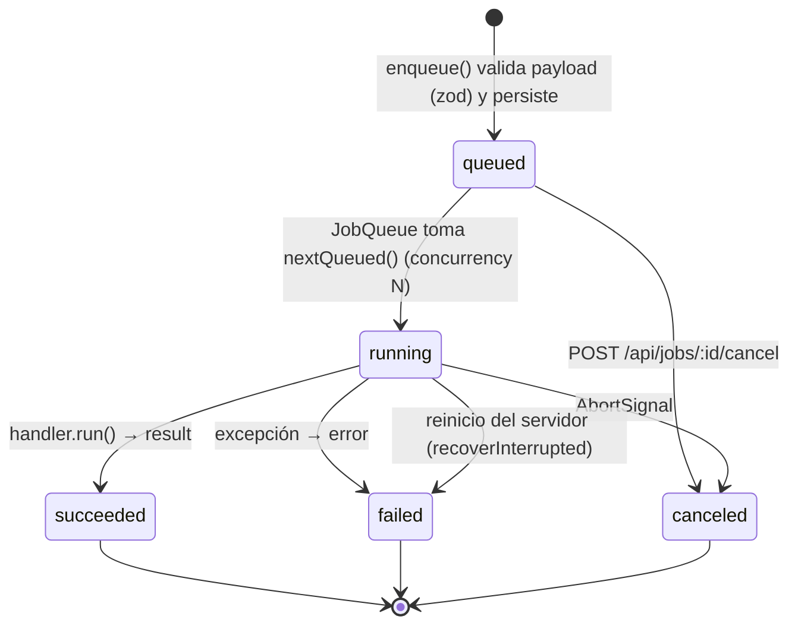

# Arquitectura — Studio

> Hito 2 del PLAN-BASE v1. Este documento es el **contrato entre módulos**: los agentes que
> implementan (a) dashboard, (b) API + FFmpeg + cola, (c) Remotion + motores, (d) workers Python +
> setup/modelos deben respetar las rutas, tipos y layout de almacenamiento definidos aquí y en
> `packages/shared`. Código y comentarios en inglés; UI en español.

## 1. Componentes y puertos

| Componente             | Ruta                      | Tecnología                                       | Puerto | Módulo |
| ---------------------- | ------------------------- | ------------------------------------------------ | ------ | ------ |
| Dashboard web          | `apps/web`                | Next.js 15 (App Router), React 19, Tailwind 4    | 3000   | (a)    |
| API local + cola       | `apps/api`                | Fastify 5, better-sqlite3, FFmpeg (child proc)   | 3001   | (b)    |
| Workers IA             | `apps/workers`            | Python 3.11, FastAPI, faster-whisper, Piper      | 8001   | (d)    |
| Contrato compartido    | `packages/shared`         | zod 4 + tipos TS                                 | —      | todos  |
| Motores de motion      | `packages/motion-engines` | Interfaz `MotionEngine` + registro + adaptadores | —      | (c)    |
| Composiciones Remotion | `packages/remotion`       | Remotion 4 (bundler + renderer)                  | —      | (c)    |
| Instalación Windows    | `scripts/windows`         | PowerShell 5.1+ (winget)                         | —      | (d)    |

Todo escucha en `127.0.0.1` (sin autenticación; fuera de alcance).

```mermaid
flowchart LR
  user([Usuario<br/>navegador]) -->|http :3000| web

  subgraph PC["PC Windows (local)"]
    web["apps/web<br/>Next.js 15 :3000"]
    api["apps/api<br/>Fastify 5 :3001"]
    db[("storage/studio.db<br/>SQLite: projects, media,<br/>jobs, presets, settings")]
    queue{{"JobQueue<br/>(in-process)"}}
    ffmpeg["FFmpeg / ffprobe<br/>(child_process)"]
    motion["@studio/motion-engines<br/>registry"]
    remotion["@studio/remotion<br/>bundle + renderMedia<br/>(Chrome Headless Shell)"]
    mc["Motion Canvas adapter<br/>(skeleton)"]
    lottie["FFmpeg+Lottie adapter<br/>(skeleton)"]
    workers["apps/workers<br/>FastAPI :8001"]
    whisper["faster-whisper"]
    piper["Piper TTS"]
    rvc["RVC (inferencia)"]
    storage[("storage/<br/>media · proxies · renders<br/>exports · library · tmp")]
    models[("models/<br/>whisper · piper · rvc")]
    cloud(["APIs opcionales<br/>ElevenLabs · OpenAI · Anthropic<br/>Freesound · Pixabay"])
  end

  web -->|REST JSON + multipart<br/>SSE /api/jobs/events| api
  web -->|GET /files/*| api
  api --> db
  api --> queue
  queue --> ffmpeg
  queue --> motion
  motion --> remotion
  motion --> mc
  motion --> lottie
  lottie --> ffmpeg
  queue -->|HTTP JSON :8001| workers
  workers --> whisper & piper & rvc
  whisper & piper & rvc -.lee.-> models
  ffmpeg <--> storage
  remotion --> storage
  workers <--> storage
  api -.solo si hay key en .env.-> cloud
```

### Flujo de datos (ejemplo del criterio de éxito 2)

1. **Importar**: web `POST /api/media` (multipart) → api guarda `storage/media/<id>.<ext>` → encola `media.probe` + `media.proxy` → `storage/proxies/<id>.mp4`.
2. **Cortar/editar**: el estado del timeline (`Project` → `Track[]` → `Clip[]`) vive en la web y se persiste con `PUT /api/projects/:id`.
3. **Subtítulos**: `POST /api/subtitles/transcribe` → job `subtitles.transcribe` → api extrae WAV 16 kHz con FFmpeg a `storage/tmp/` → `POST :8001/transcribe` → `Transcript` → se guarda en `project.subtitles`.
4. **Voz**: `POST /api/voice/tts` (Piper vía workers o API cloud) / `POST /api/voice/effects` (filtros FFmpeg) / `POST /api/voice/rvc` (workers) → `storage/renders/<jobId>.wav` + nuevo `MediaAsset`.
5. **SFX**: `GET /api/library?q=` → `POST /api/library/import` → `storage/library/...` → clip de audio.
6. **Título**: `POST /api/motion/render` (`MotionSpec{template:"title-card", format:"webm-vp9-alpha"}`) → registry → `renderMotion` → `storage/renders/<jobId>.webm`.
7. **Exportar**: `POST /api/projects/:id/export` (`presetId`) → job `project.export` → FFmpeg `filter_complex` → `storage/exports/<nombre>.mp4` → descarga por `/files/exports/...`.

## 2. Contrato REST de `apps/api` (prefijo `/api`)

Fuente de verdad: `API_ROUTES` en `packages/shared/src/api.ts` (las antiguas `API_ROUTES_EXT` /
`API_ROUTES_VOICE_AI` se fusionaron ahí en la integración). Todos los errores usan
`ApiError = { error: { code, message, details? } }`. Todo trabajo largo responde **202 `{ jobId }`**
(`JobAccepted`). CORS: `GET, HEAD, POST, PUT, PATCH, DELETE, OPTIONS` para `localhost:*`; el SSE
pone sus cabeceras CORS a mano (`lib/cors.ts`, `reply.hijack()`).

| Método               | Ruta                                      | Request → Response                                                                                                                                                                                                                                          | Módulo   |
| -------------------- | ----------------------------------------- | ----------------------------------------------------------------------------------------------------------------------------------------------------------------------------------------------------------------------------------------------------------- | -------- |
| GET                  | `/api/health`                             | → `HealthResponse` (ffmpeg, workers)                                                                                                                                                                                                                        | b        |
| GET                  | `/api/config`                             | → `AppConfig` (solo booleanos, nunca keys)                                                                                                                                                                                                                  | b        |
| GET / PUT            | `/api/settings`                           | `DashboardSettings` completo (incluye `ui`: layout, acento, presets)                                                                                                                                                                                        | b        |
| GET / POST           | `/api/projects`                           | `CreateProject` → `Project`                                                                                                                                                                                                                                 | b        |
| GET / PUT / DELETE   | `/api/projects/:id`                       | `Project`                                                                                                                                                                                                                                                   | b        |
| GET / PUT            | `/api/projects/:id/autosave`              | snapshot `Project` → `ProjectAutosaveInfo`                                                                                                                                                                                                                  | b        |
| POST                 | `/api/projects/:id/export`                | `ExportRequest` (`presetId`, `range?`, `fileName?`, `burnSubtitles?`, `useSegmentCache?` = true) → `JobAccepted` (result `ExportJobResult`: `mode`, `segments`); 409 `EXPORT_BLOCKED` con `details.problems` si hay motion sin renderizar o medios borrados | b        |
| GET / POST           | `/api/media`                              | multipart → `MediaAsset`                                                                                                                                                                                                                                    | b        |
| GET / DELETE         | `/api/media/:id`                          | → `MediaAsset`; `DELETE` da 409 `MEDIA_IN_USE` (`details.projects`) si un proyecto lo usa, salvo `?force=1`                                                                                                                                                 | b        |
| GET                  | `/api/media/:id/file`                     | stream con HTTP Range (`?proxy=1`, `?download=1`)                                                                                                                                                                                                           | b        |
| POST                 | `/api/media/:id/proxy`                    | → `JobAccepted`                                                                                                                                                                                                                                             | b        |
| GET                  | `/api/jobs?status=&type=&limit=`          | → `Job[]`                                                                                                                                                                                                                                                   | b        |
| GET                  | `/api/jobs/:id`                           | → `Job`                                                                                                                                                                                                                                                     | b        |
| GET                  | `/api/jobs/:id/log`                       | → `{ lines: string[] }`                                                                                                                                                                                                                                     | b        |
| GET                  | `/api/jobs/:id/diagnostics`               | → `JobDiagnostics` (comandos ffmpeg/ffprobe/procesos/workers, código, duración, cola de stderr)                                                                                                                                                             | reportes |
| POST                 | `/api/jobs/:id/cancel`                    | → `Job`                                                                                                                                                                                                                                                     | b        |
| GET                  | `/api/jobs/events?jobId=`                 | SSE de `JobEvent`                                                                                                                                                                                                                                           | b        |
| GET / POST           | `/api/export-presets`                     | `ExportPreset`                                                                                                                                                                                                                                              | b        |
| PUT / DELETE         | `/api/export-presets/:id`                 | `ExportPreset` (built-ins no se borran: 409)                                                                                                                                                                                                                | b        |
| GET                  | `/api/system/encoders`                    | → `EncoderInfo`                                                                                                                                                                                                                                             | b        |
| GET                  | `/api/motion/engines`                     | → `MotionEngineInfo[]` (`id`, `displayName`, `ok`, `reason?`, `capabilities`)                                                                                                                                                                               | c        |
| GET                  | `/api/motion/templates`                   | → `MotionTemplateInfo[]`                                                                                                                                                                                                                                    | c        |
| POST                 | `/api/motion/render`                      | `MotionRenderRequest` (`MotionSpec` + `target?`) → `JobAccepted`                                                                                                                                                                                            | c        |
| GET                  | `/api/voice/tts/voices`                   | → `TtsVoiceInfo[]`                                                                                                                                                                                                                                          | d        |
| GET                  | `/api/voice/tts/providers`                | → `TtsProviderInfo[]`                                                                                                                                                                                                                                       | d        |
| POST                 | `/api/voice/tts`                          | `TtsRequest` → `JobAccepted`                                                                                                                                                                                                                                | d        |
| POST                 | `/api/voice/effects`                      | `VoiceEffectRequest` → `JobAccepted`                                                                                                                                                                                                                        | b        |
| GET                  | `/api/voice/effects/presets`              | → `VOICE_EFFECT_PRESETS`                                                                                                                                                                                                                                    | b        |
| GET                  | `/api/voice/rvc/models`                   | → `RvcModel[]`                                                                                                                                                                                                                                              | d        |
| POST                 | `/api/voice/rvc`                          | `RvcRequest` → `JobAccepted`                                                                                                                                                                                                                                | d        |
| POST                 | `/api/voice/models/download`              | `ModelDownloadRequest` → `ModelDownloadResult`; errores `DOWNLOAD_OFFLINE` / `DOWNLOAD_FORBIDDEN` / `DOWNLOAD_CHECKSUM` (502)                                                                                                                               | d        |
| GET                  | `/api/voice/models/download/progress`     | `?kind=piper&id=` → `ModelDownloadProgress` (`bytes` del `.part`, `active`)                                                                                                                                                                                 | d        |
| POST                 | `/api/subtitles/transcribe`               | `TranscribeRequest` → `JobAccepted` (result `TranscribeJobResult`)                                                                                                                                                                                          | d        |
| GET                  | `/api/library?q=&kind=&provider=&page=`   | → `Paginated<LibraryItem>`                                                                                                                                                                                                                                  | d        |
| POST                 | `/api/library/import`                     | JSON `{provider, remoteId}` → `MediaAsset`; multipart → `LibraryItemDetails`                                                                                                                                                                                | d        |
| POST                 | `/api/library/scan`                       | → `LibraryScanResult`                                                                                                                                                                                                                                       | d        |
| GET / PATCH / DELETE | `/api/library/:id`                        | `LibraryItemDetails` / `LibraryItemUpdate`                                                                                                                                                                                                                  | d        |
| GET                  | `/api/library/:id/peaks`                  | → `WaveformPeaks`                                                                                                                                                                                                                                           | d        |
| GET                  | `/api/library/providers`                  | → `{id, enabled, status}[]`                                                                                                                                                                                                                                 | d        |
| GET / POST           | `/api/reports`                            | → `ReportSummary[]` / `CreateReportRequest` → `CreateReportResponse` (carpeta + zip en `storage/reports/`)                                                                                                                                                  | reportes |
| GET                  | `/api/reports/:id/download`               | → el `.zip` del reporte                                                                                                                                                                                                                                     | reportes |
| GET                  | `/api/ai/gpu`                             | → `GpuStatus` (proxy de workers `/gpu/status`)                                                                                                                                                                                                              | s1       |
| POST                 | `/api/ai/gpu/release`                     | libera el modelo residente → `GpuStatus`                                                                                                                                                                                                                    | s1       |
| GET                  | `/api/ai/packs`                           | → `Pack[]`                                                                                                                                                                                                                                                  | s1       |
| POST                 | `/api/ai/packs/:id/download`              | → `JobAccepted` (job `packs.download`; reutiliza la descarga activa del mismo pack); 404 si el pack no existe                                                                                                                                               | s1       |
| POST                 | `/api/ai/analyze/scenes`                  | `AnalyzeScenesRequest` → `JobAccepted`; 409 `PACK_REQUIRED` si falta `scenes`                                                                                                                                                                               | s1       |
| POST                 | `/api/ai/analyze/silences`                | `AnalyzeSilencesRequest` (`projectId`, `clipId`, `options`) → `JobAccepted`                                                                                                                                                                                 | s1       |
| POST                 | `/api/ai/timeline/apply-cuts`             | `ApplyCutsRequest` (`cuts` en segundos de la fuente) → `JobAccepted`                                                                                                                                                                                        | s1       |
| POST                 | `/api/ai/audio/denoise`                   | `DenoiseRequest` → `JobAccepted`; 409 `PACK_REQUIRED` si falta `voz-limpia`                                                                                                                                                                                 | s1       |
| GET / POST           | `/api/ai/perf` (POST también `/perf/run`) | último `PerfResult` (`storage/run/perf.json`, 404 si nunca corrió) / → `JobAccepted` (job `perf.run`)                                                                                                                                                       | s1       |
| GET                  | `/files/*`                                | estático desde `STORAGE_DIR` (sin `studio.db`, `tmp/`, `logs/`, `reports/` ni `cache/`)                                                                                                                                                                     | b        |

**`409 PACK_REQUIRED`** (Sprint 1): cuerpo plano `PackRequiredBody = {error:"PACK_REQUIRED", packId, name_es,
size_bytes, message}` (no `ApiError`). Lo responden las rutas cuyo pack falta (chequeo previo con
`GET /packs` de los workers) y las rutas proxy; si el error llega dentro de un job, el job falla con
ese mismo cuerpo en `job.result`. La api lo reconoce en el cuerpo de los workers arriba, en `detail`
o en `error.details`.

## 3. Contrato de `apps/workers` (interno, solo lo llama la api)

Fuente de verdad: `WORKER_ROUTES` + `Worker*Request` (TS) y `apps/workers/studio_workers/schemas.py`
(Pydantic, JSON en camelCase). **Todas las rutas de archivo son relativas a `STORAGE_DIR`**; cada
servicio las resuelve contra su propio `STORAGE_DIR` y rechaza `..`. Las llamadas son síncronas (la
cola vive en la api); con `jobId` la api consulta el progreso en `GET /jobs/:id`.

| Método | Ruta               | Request → Response                                                                              |
| ------ | ------------------ | ----------------------------------------------------------------------------------------------- |
| GET    | `/health`          | → `{status, cuda, capabilities:{whisper,piper,rvc}, ...}`                                       |
| POST   | `/transcribe`      | `{inputPath, language, model?, wordTimestamps, jobId?, outputBase?}` → `TranscriptWithFiles`    |
| GET    | `/tts/voices`      | → `TtsVoiceInfo[]` (voces Piper instaladas en `models/piper`)                                   |
| GET    | `/tts/providers`   | → `TtsProviderInfo[]`                                                                           |
| POST   | `/tts`             | `{text, voice, speed, outputPath, provider?, format?, jobId?}` → `{path, durationSec}`          |
| GET    | `/rvc/models`      | → `RvcModel[]` (`models/rvc/<nombre>/*.pth + *.index`)                                          |
| POST   | `/rvc/convert`     | `{inputPath, modelId, pitchShift, indexRate, f0Method, device?, outputPath, jobId?}` → `{path}` |
| POST   | `/models/download` | `ModelDownloadRequest` → `ModelDownloadResult`                                                  |
| GET    | `/jobs/:id`        | → `WorkerJobProgress`                                                                           |

Sprint 1 (`WORKER_AI_ROUTES`, campos snake_case): `GET /gpu/status`, `POST /gpu/release`, `GET /packs`,
`POST /packs/{id}/download` → `{task_id}`, `GET /packs/tasks/{task_id}` → `PackTask`,
`POST /analyze/scenes`, `POST /analyze/silences`, `POST /audio/denoise`, `POST /perf/run` → `{task_id}`,
`GET /perf/tasks/{task_id}` → `PackTask` (la api sondea esa ruta; si da 404, workers viejos, espera a
que cambie `storage/run/perf.json`). `GET /gpu/status` agrega `warnings: ["gpu_fallback_cpu"]` cuando
la última carga cayó a CPU. Las respuestas de `/transcribe`, `/rvc/convert` y `/audio/denoise` pueden
traer `warnings` (p. ej. `gpu_fallback_cpu`): la api las copia al `result` del job
(`TranscribeJobResult.warnings`, `AudioJobResult.warnings`) y la web muestra un aviso.

`PerfResult` (`storage/run/perf.json`): `gpu` = nombre de la GPU o `"cpu"` (texto), `gpu_status`
(copia de `/gpu/status`), `whisper_turbo_s_per_min`, `whisper_s_per_min` + `whisper_model` +
`whisper_device`, `piper_s_per_100chars`, `rvc_s_per_min`, `scenes_fps` (null = no medido),
`cpu_fallback_ok` (booleano), `ran_at`, `skipped` (`{componente: motivo}`), `errors`, `warnings`.

## 4. Ciclo de vida de un job



- Tipos (`JobType`) y carril: `media.probe`, `media.proxy`, `voice.effect`, `project.export` (ffmpeg);
  `motion.render` (motion); `voice.tts`, `voice.rvc`, `subtitles.transcribe` (workers) y, Sprint 1:

| Job                   | Carril  | Payload → resultado                                                                                                                                                                           |
| --------------------- | ------- | --------------------------------------------------------------------------------------------------------------------------------------------------------------------------------------------- |
| `packs.download`      | workers | `{packId}` → `{packId, installed}`; sondea `/packs/tasks/{id}` cada 1 s, progreso «Descargando «X» 45 % · 0,7 / 1,6 GB»                                                                       |
| `analyze.scenes`      | workers | `{assetId, threshold?, minSceneLenSec?}` → `{assetId, scenes}`; guarda `MediaAsset.scenes`                                                                                                    |
| `analyze.silences`    | workers | `{projectId, clipId, options}` → `{cuts, total_removed_s, timeBase:"source"}`; manda las palabras de los subtítulos del clip; no aplica nada                                                  |
| `timeline.apply-cuts` | edit    | `{projectId, clipId, cuts}` → `{project, removedSec, pieceIds}`; parte el clip, ripple de la misma pista, overlays enlazados y subtítulos; guarda el proyecto (deshacer = `PUT` del anterior) |
| `audio.denoise`       | workers | `{assetId}` → `AudioJobResult` (nuevo asset `renders/<jobId>.wav` + `media.probe`)                                                                                                            |
| `perf.run`            | workers | `{}` → `PerfResult`; sondea `/perf/tasks/{id}`                                                                                                                                                |

Overlays enlazados en `apply-cuts`: los clips de pistas motion/texto que se solapan con el clip cortado
arrancan en el siguiente instante conservado; los `animated-captions` se re-temporizan palabra por
palabra y pierden `renderedAssetId` (hay que volver a renderizarlos); los posteriores se corren
junto con el ripple. Las pistas de audio y otras de video no se tocan. El carril `edit` (2 a la vez)
evita que un corte espere detrás de una exportación.

- Cada tipo tiene **un** `JobHandler { type, parse(payload), run(payload, ctx, job) }` registrado
  en `apps/api/src/app.ts` (`queue.register(...)`). `ctx` da `signal`, `reportProgress(0..1, msg)`
  y `storageDir`.
- Progreso y estado se emiten como `JobEvent` por SSE (`/api/jobs/events`); la web nunca hace
  polling agresivo.
- Resultado estándar de jobs que generan archivo: `FileJobResult { assetId?, path }`.

## 5. Almacenamiento

```
storage/                 # STORAGE_DIR (git-ignored)
├── studio.db            # SQLite (better-sqlite3, WAL)
├── media/               # originales importados        <assetId>.<ext>
├── proxies/             # proxies, miniaturas, waveforms <assetId>.mp4 | .jpg | .png
├── renders/             # intermedios generados        <jobId>.mp4 | .mov | .wav
├── exports/             # exportaciones finales        <nombre>-<fecha>.mp4
├── library/             # SFX / música local           <kind>/<id>.<ext> (+ licencia en DB)
├── cache/segments/      # bloques del render por bloques <sha1>.mp4 (LRU, SEGMENT_CACHE_MAX_GB)
├── run/                 # estado de servicios: perf.json (test de rendimiento IA)
└── tmp/                 # temporales (se pueden borrar)
models/                  # MODELS_DIR (git-ignored)
├── whisper/             # faster-whisper (CTranslate2)
├── piper/               # <voz>.onnx + <voz>.onnx.json
└── rvc/<nombre>/        # model.pth + model.index (aportados por el usuario)
```

Constantes en `packages/shared/src/storage.ts` (`STORAGE_SUBDIRS`, `DB_FILENAME`, `TMP_SUBDIR`,
`SEGMENT_CACHE_SUBDIR`, `RUN_SUBDIR`).

### 5.1 Render por bloques (caché de segmentos)

`project.export` con `useSegmentCache` (por defecto) — `services/ffmpeg/segments.ts`:

1. **Plan**: ventanas sobre la grilla de cuadros de la salida, cortadas en límites de clips (video,
   motion y texto), de 10 s como máximo (codiciosa: el último límite seguro antes de 10 s, si no un
   corte forzado).
2. **Hash** por ventana: sha1 de un JSON canónico con los clips visuales recortados (ids + mtime/tamaño
   del archivo + trim + velocidad + opacidad + crop + posición/escala + transiciones), textos y
   subtítulos relativos a la ventana, estilo de subtítulos, etiqueta IA, lienzo, parámetros de video
   del preset, encoder, versión de ffmpeg y `COMPILER_VERSION`. Volumen, efectos de voz y pistas de
   audio no entran (el audio va aparte).
3. **Render** de cada ventana que no esté en `cache/segments/<hash>.mp4`: el mismo compilador con
   `window` (solo video, `-g 2·fps`, `-force_key_frames 0`, `-frames:v N`, `-an`); los textos, los
   subtítulos ASS y la etiqueta IA usan el tiempo absoluto (`setpts` desplazado alrededor), así cada
   cuadro es igual al de la pasada única. Se escribe a `.part.mp4` y se renombra.
4. **Audio** de todo el rango una sola vez (`audioOnly`), **concat demuxer `-c copy`** de los bloques +
   mux. Progreso «N/M bloques (K en caché)». Después, LRU por `mtime` (un acierto lo renueva) hasta
   `SEGMENT_CACHE_MAX_GB` (10 por defecto).

**Vuelta a la pasada única** (`result.mode = "single"`, `fallbackReason`): presets GIF, con alfa, o que
no sean H.264/H.265 en MP4/MOV; y cuando un corte no puede esquivar una ventana de transición. Las
ventanas prohibidas son `(inicio, inicio+2d)` y `(fin−2d, fin)` para fundidos, y `(B.inicio−2d,
B.inicio+2d)` para un xfade A|B (el xfade cae entero en un bloque, con al menos 2d de cada clip). Un corte
forzado se corre a la izquierda fuera de la ventana; si el bloque queda de menos de 0,5 s, se usa la
pasada única. Si el encoder por hardware falla en un bloque, todo se repite con libx264.

**NVENC en proxies e intermedios**: `media.proxy` y los bloques usan el encoder de `selectEncoder`
(NVENC/QSV/AMF detectado, `HW_ENCODER=off` fuerza libx264) y reintentan una vez con libx264 si el
hardware falla (el encoder queda desactivado hasta volver a detectar).

**Etiqueta IA** (`project.publish.aiLabel`): `drawtext` abajo a la izquierda durante todo el video, texto
`aiLabelText` o «Contenido alterado con IA», fuente y tamaño (0,42 × `fontSize`) del estilo de
subtítulos; igual en la pasada única y en los bloques.

## 6. Motores de motion graphics

Contrato adoptado de la propuesta de `docs/trabajo/fuentes-motion.md` §5 (con tiempos en segundos y
rutas relativas a `STORAGE_DIR`, como el resto del contrato):

- `MotionSpec` (shared, versionado `schemaVersion: 1`): `engine?`, `template`, `props`, `media?`
  (`MotionMediaRef`), `durationSec`, `fps`, `width`, `height`, `format`
  (`mp4-h264 | webm-vp9-alpha | prores-4444 | png-sequence`), `includeAudio`, `seed?`.
- `MotionEngine` (motion-engines): `capabilities()`, `checkAvailable()` → `{ok, reason?}` (no lanza),
  `listTemplates()`, `validate(spec)`, `render(spec, ctx)`, `dispose?()`.
- `MotionEngineRegistry`: `register`, `get`, `resolve(spec)` (usa `spec.engine` o el primer motor
  cuyas capacidades cubren plantilla + formato), `render` (resolve → validate → render), `status`.
- `MotionRenderContext`: `jobId`, `storageDir`, `outputPath` (relativo), `tmpDir`, `mediaBaseUrl`
  (`http://127.0.0.1:3001/files/`), `signal`, `onProgress({phase, ratio, message})`.

La api crea el registro con
`createDefaultRegistry({ remotion: REMOTION_ENGINE_OPTIONS, ffmpegPath })` en `apps/api/src/app.ts`, donde
también registra el handler `motion.render` (con `target` enlaza `clip.renderedAssetId`).
Overlays con alpha: `webm-vp9-alpha` para el editor, `prores-4444` para editores externos.

| Motor           | Estado                                                                                                         | Plantillas                                                                                                                                                                            |
| --------------- | -------------------------------------------------------------------------------------------------------------- | ------------------------------------------------------------------------------------------------------------------------------------------------------------------------------------- |
| `remotion`      | Principal. Render real vía `@studio/remotion` (`REMOTION_ENGINE_OPTIONS`)                                      | `REMOTION_TEMPLATE_IDS` (9): `title-card`, `lower-third`, `animated-captions`, `transition`, `audio-visualizer`, `lottie-overlay`, `end-screen`, `progress-bar`, `kinetic-typography` |
| `motion-canvas` | Esqueleto (`checkAvailable → ok:false`, render → `MotionEngineNotImplementedError`); implementar sobre Revideo | `hello-circle` (ejemplo)                                                                                                                                                              |
| `ffmpeg-lottie` | Real con FFmpeg de sistema (drawtext + overlay alpha); rasterizador Lottie pendiente                           | `ffmpeg-title`                                                                                                                                                                        |

Añadir un motor = implementar `MotionEngine` + `register()`; el id debe estar en `MotionEngineIdSchema`.

## 7. Paquetes, build y resolución

- `packages/*` exportan con la condición personalizada **`@studio/source`** → `src/*.ts` (usada por
  `tsc --noEmit`, Vitest y `tsx` en dev) y `types`/`import` → `dist/` (usada por `next build`,
  `node dist/` y los `tsconfig.build.json`). Así `pnpm typecheck` no requiere build previo.
- `pnpm build` respeta el orden topológico: `shared → motion-engines → remotion → api`, `web`.
- `pnpm dev` compila `packages/*` y luego levanta web + api en paralelo (workers aparte, ver README).
- Remotion: los imports estilo NodeNext (`./Root.js`) se resuelven con `src/webpack-override.ts`
  (usado por `remotion.config.ts` y `renderMotion`).

## 7.1 Decisiones fijadas (versiones y librerías)

| Tema           | Decisión                                                                                                                                                                         |
| -------------- | -------------------------------------------------------------------------------------------------------------------------------------------------------------------------------- |
| Toolchain      | Node 22 (`.nvmrc`), pnpm 12 (`npm i -g pnpm@12`, no corepack), TypeScript ~6.0.3 (7.x rompe typescript-eslint), ESLint ^9.39 (10.x rompe eslint-config-next), Prettier, Vitest 4 |
| Builds nativos | `allowBuilds` en `pnpm-workspace.yaml` (better-sqlite3 13 trae prebuilds win32/linux)                                                                                            |
| Base de datos  | better-sqlite3 13 **detrás del adaptador** `apps/api/src/db/adapter.ts` (`SqlDatabase`); nada fuera de `db/database.ts` importa el driver                                        |
| Cola           | `p-queue` para concurrencia dentro de `JobQueue`; estado persistido en SQLite                                                                                                    |
| FFmpeg         | `spawn` directo (sin shell, sin fluent-ffmpeg — archivado) con `-progress pipe:1`                                                                                                |
| Eventos        | SSE crudo en Fastify 5 (`reply.hijack()`), sin plugin                                                                                                                            |
| Dashboard      | `dockview` 8 para paneles; `wavesurfer.js` 8 para formas de onda                                                                                                                 |
| Remotion       | Todos los `@remotion/*` fijados a **4.0.532** exacto                                                                                                                             |
| Python         | 3.11.9; `piper-tts==1.8.0`, `faster-whisper==1.2.1`, `infer-rvc-python==1.3.1` (extra `rvc`, torch CPU/CUDA lo instala setup.ps1)                                                |
| Fin de línea   | `.gitattributes` fuerza LF (CRLF rompe Prettier en Windows); `.ps1` en CRLF                                                                                                      |
| CI             | GitHub Actions, matriz ubuntu + windows, `shell: bash`                                                                                                                           |

## 8. Configuración y secretos

- Un único `.env` en la raíz (copiar de `.env.example`), leído por la api (`process.loadEnvFile`) y
  por los workers (`pydantic-settings`). Todas las API keys son **opcionales y vacías** por defecto.
- `/api/config` expone solo `Boolean(key)`; las keys nunca llegan al navegador.

## 9. Propiedad de módulos (Hito 3)

| Módulo                      | Archivos                                                                                                        | Marcador         |
| --------------------------- | --------------------------------------------------------------------------------------------------------------- | ---------------- |
| (a) Dashboard web           | `apps/web/**`                                                                                                   | `TODO(module-a)` |
| (b) API + FFmpeg + cola     | `apps/api/**` (salvo handlers motion/voz-IA)                                                                    | `TODO(module-b)` |
| (c) Remotion + motores      | `packages/remotion/**`, `packages/motion-engines/**`, handler `motion.render`                                   | `TODO(module-c)` |
| (d) Workers + setup/modelos | `apps/workers/**`, `scripts/windows/**`, handlers `voice.tts`/`voice.rvc`/`subtitles.transcribe`, rutas library | `TODO(module-d)` |

Cambios a `packages/shared` (contrato) deben ser **aditivos**; si un módulo necesita romper el
contrato, lo coordina el orquestador. Buscar pendientes: `grep -rn "TODO(module-" apps packages scripts`.
