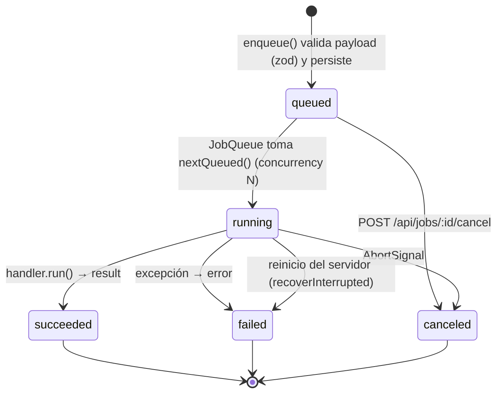

# Arquitectura — Studio

> Hito 2 del PLAN-BASE v1. Este documento es el **contrato entre módulos**: los agentes que
> implementan (a) dashboard, (b) API + FFmpeg + cola, (c) Remotion + motores, (d) workers Python +
> setup/modelos deben respetar las rutas, tipos y layout de almacenamiento definidos aquí y en
> `packages/shared`. Código y comentarios en inglés; UI en español.

## 1. Componentes y puertos

| Componente             | Ruta                      | Tecnología                                       | Puerto | Módulo |
| ---------------------- | ------------------------- | ------------------------------------------------ | ------ | ------ |
| Dashboard web          | `apps/web`                | Next.js 15 (App Router), React 19, Tailwind 4    | 3000   | (a)    |
| API local + cola       | `apps/api`                | Fastify 5, better-sqlite3, FFmpeg (child proc)   | 3001   | (b)    |
| Workers IA             | `apps/workers`            | Python 3.11, FastAPI, faster-whisper, Piper      | 8001   | (d)    |
| Contrato compartido    | `packages/shared`         | zod 4 + tipos TS                                 | —      | todos  |
| Motores de motion      | `packages/motion-engines` | Interfaz `MotionEngine` + registro + adaptadores | —      | (c)    |
| Composiciones Remotion | `packages/remotion`       | Remotion 4 (bundler + renderer)                  | —      | (c)    |
| Instalación Windows    | `scripts/windows`         | PowerShell 5.1+ (winget)                         | —      | (d)    |

Todo escucha en `127.0.0.1` (sin autenticación; fuera de alcance).

```mermaid
flowchart LR
  user([Usuario<br/>navegador]) -->|http :3000| web

  subgraph PC["PC Windows (local)"]
    web["apps/web<br/>Next.js 15 :3000"]
    api["apps/api<br/>Fastify 5 :3001"]
    db[("storage/studio.db<br/>SQLite: projects, media,<br/>jobs, presets, settings")]
    queue{{"JobQueue<br/>(in-process)"}}
    ffmpeg["FFmpeg / ffprobe<br/>(child_process)"]
    motion["@studio/motion-engines<br/>registry"]
    remotion["@studio/remotion<br/>bundle + renderMedia<br/>(Chrome Headless Shell)"]
    mc["Motion Canvas adapter<br/>(skeleton)"]
    lottie["FFmpeg+Lottie adapter<br/>(skeleton)"]
    workers["apps/workers<br/>FastAPI :8001"]
    whisper["faster-whisper"]
    piper["Piper TTS"]
    rvc["RVC (inferencia)"]
    storage[("storage/<br/>media · proxies · renders<br/>exports · library · tmp")]
    models[("models/<br/>whisper · piper · rvc")]
    cloud(["APIs opcionales<br/>ElevenLabs · OpenAI · Anthropic<br/>Freesound · Pixabay"])
  end

  web -->|REST JSON + multipart<br/>SSE /api/jobs/events| api
  web -->|GET /files/*| api
  api --> db
  api --> queue
  queue --> ffmpeg
  queue --> motion
  motion --> remotion
  motion --> mc
  motion --> lottie
  lottie --> ffmpeg
  queue -->|HTTP JSON :8001| workers
  workers --> whisper & piper & rvc
  whisper & piper & rvc -.lee.-> models
  ffmpeg <--> storage
  remotion --> storage
  workers <--> storage
  api -.solo si hay key en .env.-> cloud
```

### Flujo de datos (ejemplo del criterio de éxito 2)

1. **Importar**: web `POST /api/media` (multipart) → api guarda `storage/media/<id>.<ext>` → encola `media.probe` + `media.proxy` → `storage/proxies/<id>.mp4`.
2. **Cortar/editar**: el estado del timeline (`Project` → `Track[]` → `Clip[]`) vive en la web y se persiste con `PUT /api/projects/:id`.
3. **Subtítulos**: `POST /api/subtitles/transcribe` → job `subtitles.transcribe` → api extrae WAV 16 kHz con FFmpeg a `storage/tmp/` → `POST :8001/transcribe` → `Transcript` → se guarda en `project.subtitles`.
4. **Voz**: `POST /api/voice/tts` (Piper vía workers o API cloud) / `POST /api/voice/effects` (filtros FFmpeg) / `POST /api/voice/rvc` (workers) → `storage/renders/<jobId>.wav` + nuevo `MediaAsset`.
5. **SFX**: `GET /api/library?q=` → `POST /api/library/import` → `storage/library/...` → clip de audio.
6. **Título**: `POST /api/motion/render` (`MotionSpec{template:"title-card", format:"webm-vp9-alpha"}`) → registry → `renderMotion` → `storage/renders/<jobId>.webm`.
7. **Exportar**: `POST /api/projects/:id/export` (`presetId`) → job `project.export` → FFmpeg `filter_complex` → `storage/exports/<nombre>.mp4` → descarga por `/files/exports/...`.

## 2. Contrato REST de `apps/api` (prefijo `/api`)

Fuente de verdad: `API_ROUTES` en `packages/shared/src/api.ts`. Todos los errores usan
`ApiError = { error: { code, message, details? } }`. Endpoints aún sin implementar responden
**501 `NOT_IMPLEMENTED`**. Todo trabajo largo responde **202-like `{ jobId }`** (`JobAccepted`).

| Método             | Ruta                                    | Request → Response                         | Estado skeleton         | Módulo        |
| ------------------ | --------------------------------------- | ------------------------------------------ | ----------------------- | ------------- |
| GET                | `/api/health`                           | → `HealthResponse` (ffmpeg, workers)       | ✅                      | b             |
| GET                | `/api/config`                           | → `AppConfig` (solo booleanos, nunca keys) | ✅                      | b             |
| GET / PUT          | `/api/settings`                         | `DashboardSettings`                        | GET defaults / PUT 501  | b (a consume) |
| GET / POST         | `/api/projects`                         | `CreateProject` → `Project`                | 501                     | b             |
| GET / PUT / DELETE | `/api/projects/:id`                     | `Project`                                  | 501                     | b             |
| POST               | `/api/projects/:id/export`              | `ExportRequest` → `JobAccepted`            | 501                     | b             |
| GET / POST         | `/api/media`                            | multipart → `MediaAsset`                   | 501                     | b             |
| GET / DELETE       | `/api/media/:id`                        | → `MediaAsset`                             | 501                     | b             |
| GET                | `/api/media/:id/file`                   | stream con HTTP Range                      | 501                     | b             |
| POST               | `/api/media/:id/proxy`                  | → `JobAccepted`                            | 501                     | b             |
| GET                | `/api/jobs?status=&type=&limit=`        | → `Job[]`                                  | ✅                      | b             |
| GET                | `/api/jobs/:id`                         | → `Job`                                    | ✅                      | b             |
| POST               | `/api/jobs/:id/cancel`                  | → `Job`                                    | parcial (TODO abort)    | b             |
| GET                | `/api/jobs/events`                      | SSE de `JobEvent`                          | 501                     | b             |
| GET / POST         | `/api/export-presets`                   | `ExportPreset`                             | GET defaults / POST 501 | b             |
| PUT / DELETE       | `/api/export-presets/:id`               | `ExportPreset`                             | 501                     | b             |
| GET                | `/api/motion/engines`                   | → `{id, displayName, available}[]`         | ✅                      | c             |
| GET                | `/api/motion/templates`                 | → `MotionTemplateInfo[]`                   | ✅                      | c             |
| POST               | `/api/motion/render`                    | `MotionSpec` → `JobAccepted`               | 501                     | c             |
| GET                | `/api/voice/tts/voices`                 | → `TtsVoice[]`                             | 501                     | d             |
| POST               | `/api/voice/tts`                        | `TtsRequest` → `JobAccepted`               | 501                     | d             |
| POST               | `/api/voice/effects`                    | `VoiceEffectRequest` → `JobAccepted`       | 501                     | b             |
| GET                | `/api/voice/rvc/models`                 | → `RvcModel[]`                             | 501                     | d             |
| POST               | `/api/voice/rvc`                        | `RvcRequest` → `JobAccepted`               | 501                     | d             |
| POST               | `/api/subtitles/transcribe`             | `TranscribeRequest` → `JobAccepted`        | 501                     | d             |
| GET                | `/api/library?q=&kind=&provider=&page=` | → `Paginated<LibraryItem>`                 | 501                     | d             |
| POST               | `/api/library/import`                   | multipart o `{provider, remoteId}`         | 501                     | d             |
| GET                | `/api/library/providers`                | → `{id, enabled}[]`                        | ✅                      | d             |
| GET                | `/files/*`                              | estático desde `STORAGE_DIR`               | ✅                      | b             |

## 3. Contrato de `apps/workers` (interno, solo lo llama la api)

Fuente de verdad: `WORKER_ROUTES` (TS) y `apps/workers/studio_workers/schemas.py` (Pydantic, JSON en
camelCase). **Todas las rutas de archivo son relativas a `STORAGE_DIR`**; cada servicio las resuelve
contra su propio `STORAGE_DIR` y rechaza `..`. Las llamadas son síncronas (la cola vive en la api).

| Método | Ruta           | Request → Response                                                                      | Estado |
| ------ | -------------- | --------------------------------------------------------------------------------------- | ------ |
| GET    | `/health`      | → `{status, cuda, capabilities:{whisper,piper,rvc}}`                                    | ✅     |
| POST   | `/transcribe`  | `{inputPath, language, model?, wordTimestamps}` → `Transcript`                          | 501    |
| GET    | `/tts/voices`  | → `TtsVoice[]` (voces Piper instaladas en `models/piper`)                               | `[]`   |
| POST   | `/tts`         | `{text, voice, speed, outputPath}` → `{path, durationSec}`                              | 501    |
| GET    | `/rvc/models`  | → `RvcModel[]` (`models/rvc/<nombre>/*.pth + *.index`)                                  | `[]`   |
| POST   | `/rvc/convert` | `{inputPath, modelId, pitchShift, indexRate, f0Method, device?, outputPath}` → `{path}` | 501    |

## 4. Ciclo de vida de un job



- Tipos (`JobType`): `media.probe`, `media.proxy`, `motion.render`, `voice.tts`, `voice.effect`,
  `voice.rvc`, `subtitles.transcribe`, `project.export`.
- Cada tipo tiene **un** `JobHandler { type, parse(payload), run(payload, ctx, job) }` registrado
  en `apps/api/src/app.ts` (`queue.register(...)`). `ctx` da `signal`, `reportProgress(0..1, msg)`
  y `storageDir`.
- Progreso y estado se emiten como `JobEvent` por SSE (`/api/jobs/events`); la web nunca hace
  polling agresivo.
- Resultado estándar de jobs que generan archivo: `FileJobResult { assetId?, path }`.

## 5. Almacenamiento

```
storage/                 # STORAGE_DIR (git-ignored)
├── studio.db            # SQLite (better-sqlite3, WAL)
├── media/               # originales importados        <assetId>.<ext>
├── proxies/             # proxies, miniaturas, waveforms <assetId>.mp4 | .jpg | .png
├── renders/             # intermedios generados        <jobId>.mp4 | .mov | .wav
├── exports/             # exportaciones finales        <nombre>-<fecha>.mp4
├── library/             # SFX / música local           <kind>/<id>.<ext> (+ licencia en DB)
└── tmp/                 # temporales (se pueden borrar)
models/                  # MODELS_DIR (git-ignored)
├── whisper/             # faster-whisper (CTranslate2)
├── piper/               # <voz>.onnx + <voz>.onnx.json
└── rvc/<nombre>/        # model.pth + model.index (aportados por el usuario)
```

Constantes en `packages/shared/src/storage.ts` (`STORAGE_SUBDIRS`, `DB_FILENAME`, `TMP_SUBDIR`).

## 6. Motores de motion graphics

Contrato adoptado de la propuesta de `docs/trabajo/fuentes-motion.md` §5 (con tiempos en segundos y
rutas relativas a `STORAGE_DIR`, como el resto del contrato):

- `MotionSpec` (shared, versionado `schemaVersion: 1`): `engine?`, `template`, `props`, `media?`
  (`MotionMediaRef`), `durationSec`, `fps`, `width`, `height`, `format`
  (`mp4-h264 | webm-vp9-alpha | prores-4444 | png-sequence`), `includeAudio`, `seed?`.
- `MotionEngine` (motion-engines): `capabilities()`, `checkAvailable()` → `{ok, reason?}` (no lanza),
  `listTemplates()`, `validate(spec)`, `render(spec, ctx)`, `dispose?()`.
- `MotionEngineRegistry`: `register`, `get`, `resolve(spec)` (usa `spec.engine` o el primer motor
  cuyas capacidades cubren plantilla + formato), `render` (resolve → validate → render), `status`.
- `MotionRenderContext`: `jobId`, `storageDir`, `outputPath` (relativo), `tmpDir`, `mediaBaseUrl`
  (`http://127.0.0.1:3001/files/`), `signal`, `onProgress({phase, ratio, message})`.

La api crea el registro con
`createDefaultRegistry({ remotion: { templates: REMOTION_TEMPLATES, render: renderMotion }, ffmpegPath })`.
Overlays con alpha: `webm-vp9-alpha` para el editor, `prores-4444` para editores externos.

| Motor           | Estado                                                                                                         | Plantillas                                                     |
| --------------- | -------------------------------------------------------------------------------------------------------------- | -------------------------------------------------------------- |
| `remotion`      | Principal. Render real vía `@studio/remotion` (`renderMotion`, inyectado)                                      | `title-card`, `lower-third`, `animated-captions`, `transition` |
| `motion-canvas` | Esqueleto (`checkAvailable → ok:false`, render → `MotionEngineNotImplementedError`); implementar sobre Revideo | `hello-circle` (ejemplo)                                       |
| `ffmpeg-lottie` | Esqueleto (idem); frames PNG (puppeteer + lottie-web) → FFmpeg alpha                                           | `lottie-overlay` (ejemplo)                                     |

Añadir un motor = implementar `MotionEngine` + `register()`; el id debe estar en `MotionEngineIdSchema`.

## 7. Paquetes, build y resolución

- `packages/*` exportan con la condición personalizada **`@studio/source`** → `src/*.ts` (usada por
  `tsc --noEmit`, Vitest y `tsx` en dev) y `types`/`import` → `dist/` (usada por `next build`,
  `node dist/` y los `tsconfig.build.json`). Así `pnpm typecheck` no requiere build previo.
- `pnpm build` respeta el orden topológico: `shared → motion-engines → remotion → api`, `web`.
- `pnpm dev` compila `packages/*` y luego levanta web + api en paralelo (workers aparte, ver README).
- Remotion: los imports estilo NodeNext (`./Root.js`) se resuelven con `src/webpack-override.ts`
  (usado por `remotion.config.ts` y `renderMotion`).

## 7.1 Decisiones fijadas (versiones y librerías)

| Tema           | Decisión                                                                                                                                                                         |
| -------------- | -------------------------------------------------------------------------------------------------------------------------------------------------------------------------------- |
| Toolchain      | Node 22 (`.nvmrc`), pnpm 12 (`npm i -g pnpm@12`, no corepack), TypeScript ~6.0.3 (7.x rompe typescript-eslint), ESLint ^9.39 (10.x rompe eslint-config-next), Prettier, Vitest 4 |
| Builds nativos | `allowBuilds` en `pnpm-workspace.yaml` (better-sqlite3 13 trae prebuilds win32/linux)                                                                                            |
| Base de datos  | better-sqlite3 13 **detrás del adaptador** `apps/api/src/db/adapter.ts` (`SqlDatabase`); nada fuera de `db/database.ts` importa el driver                                        |
| Cola           | `p-queue` para concurrencia dentro de `JobQueue`; estado persistido en SQLite                                                                                                    |
| FFmpeg         | `spawn` directo (sin shell, sin fluent-ffmpeg — archivado) con `-progress pipe:1`                                                                                                |
| Eventos        | SSE crudo en Fastify 5 (`reply.hijack()`), sin plugin                                                                                                                            |
| Dashboard      | `dockview` 8 para paneles; `wavesurfer.js` 8 para formas de onda                                                                                                                 |
| Remotion       | Todos los `@remotion/*` fijados a **4.0.532** exacto                                                                                                                             |
| Python         | 3.11.9; `piper-tts==1.8.0`, `faster-whisper==1.2.1`, `infer-rvc-python==1.3.1` (extra `rvc`, torch CPU/CUDA lo instala setup.ps1)                                                |
| Fin de línea   | `.gitattributes` fuerza LF (CRLF rompe Prettier en Windows); `.ps1` en CRLF                                                                                                      |
| CI             | GitHub Actions, matriz ubuntu + windows, `shell: bash`                                                                                                                           |

## 8. Configuración y secretos

- Un único `.env` en la raíz (copiar de `.env.example`), leído por la api (`process.loadEnvFile`) y
  por los workers (`pydantic-settings`). Todas las API keys son **opcionales y vacías** por defecto.
- `/api/config` expone solo `Boolean(key)`; las keys nunca llegan al navegador.

## 9. Propiedad de módulos (Hito 3)

| Módulo                      | Archivos                                                                                                        | Marcador         |
| --------------------------- | --------------------------------------------------------------------------------------------------------------- | ---------------- |
| (a) Dashboard web           | `apps/web/**`                                                                                                   | `TODO(module-a)` |
| (b) API + FFmpeg + cola     | `apps/api/**` (salvo handlers motion/voz-IA)                                                                    | `TODO(module-b)` |
| (c) Remotion + motores      | `packages/remotion/**`, `packages/motion-engines/**`, handler `motion.render`                                   | `TODO(module-c)` |
| (d) Workers + setup/modelos | `apps/workers/**`, `scripts/windows/**`, handlers `voice.tts`/`voice.rvc`/`subtitles.transcribe`, rutas library | `TODO(module-d)` |

Cambios a `packages/shared` (contrato) deben ser **aditivos**; si un módulo necesita romper el
contrato, lo coordina el orquestador. Buscar pendientes: `grep -rn "TODO(module-" apps packages scripts`.
