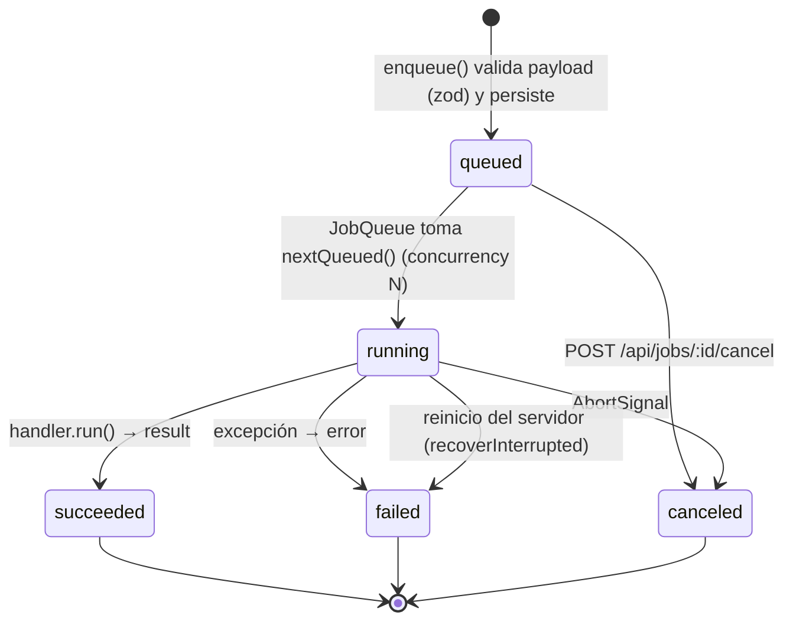

# Arquitectura — Studio

> Hito 2 del PLAN-BASE v1. Este documento es el **contrato entre módulos**: los agentes que
> implementan (a) dashboard, (b) API + FFmpeg + cola, (c) Remotion + motores, (d) workers Python +
> setup/modelos deben respetar las rutas, tipos y layout de almacenamiento definidos aquí y en
> `packages/shared`. Código y comentarios en inglés; UI en español.

## 1. Componentes y puertos

| Componente             | Ruta                      | Tecnología                                                                                                  | Puerto | Módulo  |
| ---------------------- | ------------------------- | ----------------------------------------------------------------------------------------------------------- | ------ | ------- |
| Dashboard web          | `apps/web`                | Next.js 15 (App Router), React 19, Tailwind 4                                                               | 3000   | (a)     |
| API local + cola       | `apps/api`                | Fastify 5, better-sqlite3, FFmpeg (child proc)                                                              | 3001   | (b)     |
| Workers IA             | `apps/workers`            | Python 3.11, FastAPI, faster-whisper, Piper                                                                 | 8001   | (d)     |
| Contrato compartido    | `packages/shared`         | zod 4 + tipos TS                                                                                            | —      | todos   |
| Motores de motion      | `packages/motion-engines` | Interfaz `MotionEngine` + registro + adaptadores                                                            | —      | (c)     |
| Composiciones Remotion | `packages/remotion`       | Remotion 4 (bundler + renderer)                                                                             | —      | (c)     |
| Instalación Windows    | `scripts/windows`         | PowerShell 5.1+ (winget)                                                                                    | —      | (d)     |
| Servidor MCP (3b)      | `packages/studio-mcp`     | `@modelcontextprotocol/sdk` (stdio) → API local                                                             | —      | consola |
| Consola Claude (3b)    | `apps/api/src/console`    | `@lydell/node-pty` + `@fastify/websocket`, xterm                                                            | (3001) | consola |
| FaceFusion (s4)        | `tools/facefusion`        | FaceFusion 3.9.1, Python 3.12, onnxruntime-gpu; subproceso por trabajo de los workers                       | —      | M1/M3   |
| Chatterbox (s4)        | `tools/chatterbox`        | Chatterbox Multilingual, Python 3.11, torch 2.6; subproceso persistente (JSON por stdin/stdout, sin puerto) | —      | M2/M3   |

Todo escucha en `127.0.0.1` (sin autenticación; fuera de alcance).

```mermaid
flowchart LR
  user([Usuario<br/>navegador]) -->|http :3000| web

  subgraph PC["PC Windows (local)"]
    web["apps/web<br/>Next.js 15 :3000"]
    api["apps/api<br/>Fastify 5 :3001"]
    db[("storage/studio.db<br/>SQLite: projects, media,<br/>jobs, presets, settings")]
    queue{{"JobQueue<br/>(in-process)"}}
    ffmpeg["FFmpeg / ffprobe<br/>(child_process)"]
    motion["@studio/motion-engines<br/>registry"]
    remotion["@studio/remotion<br/>bundle + renderMedia<br/>(Chrome Headless Shell)"]
    mc["Motion Canvas adapter<br/>(skeleton)"]
    lottie["FFmpeg+Lottie adapter<br/>(skeleton)"]
    workers["apps/workers<br/>FastAPI :8001"]
    whisper["faster-whisper"]
    piper["Piper TTS"]
    rvc["RVC (inferencia)"]
    storage[("storage/<br/>media · proxies · renders<br/>exports · library · tmp")]
    models[("models/<br/>whisper · piper · rvc")]
    cloud(["APIs opcionales<br/>ElevenLabs · OpenAI · Anthropic<br/>Freesound · Pixabay"])
  end

  web -->|REST JSON + multipart<br/>SSE /api/jobs/events| api
  web -->|GET /files/*| api
  api --> db
  api --> queue
  queue --> ffmpeg
  queue --> motion
  motion --> remotion
  motion --> mc
  motion --> lottie
  lottie --> ffmpeg
  queue -->|HTTP JSON :8001| workers
  workers --> whisper & piper & rvc
  whisper & piper & rvc -.lee.-> models
  ffmpeg <--> storage
  remotion --> storage
  workers <--> storage
  api -.solo si hay key en .env.-> cloud
```

### Flujo de datos (ejemplo del criterio de éxito 2)

1. **Importar**: web `POST /api/media` (multipart) → api guarda `storage/media/<id>.<ext>` → encola `media.probe` + `media.proxy` → `storage/proxies/<id>.mp4`.
2. **Cortar/editar**: el estado del timeline (`Project` → `Track[]` → `Clip[]`) vive en la web y se persiste con `PUT /api/projects/:id`.
3. **Subtítulos**: `POST /api/subtitles/transcribe` → job `subtitles.transcribe` → api extrae WAV 16 kHz con FFmpeg a `storage/tmp/` → `POST :8001/transcribe` → `Transcript` → se guarda en `project.subtitles`.
4. **Voz**: `POST /api/voice/tts` (Piper vía workers o API cloud) / `POST /api/voice/effects` (filtros FFmpeg) / `POST /api/voice/rvc` (workers) → `storage/renders/<jobId>.wav` + nuevo `MediaAsset`.
   Sprint 4, `provider: "chatterbox"`: api (validación, pack `tts-chatterbox`, `ConsentGate.assertConsent(personId, "voice")` + `voiceSamplePath`, o asset `voice-ref` de «Voz propia») → job `voice.tts` (repite los chequeos al empezar) → workers `POST /tts` (`voiceRef {path, consent}`) → `ChatterboxClient` → `tools/launch.py` → `studio_tts_server.py` → WAV 24 kHz → MP3 + `MediaAsset` con `aiAltered` y `aiProvenance` (`voice-synthetic` | `voice-cloned`) + `consent_audit` `voice.clone`.
5. **Cambio de cara (Sprint 4)**: `POST /api/face/swap` (`FaceSwapRequest`, `confirmed: true`) → chequeo previo (licencia `faceswap` → pack → consentimiento de rostro → entorno `tools/facefusion` → límites) → job `face.swap` (lo repite al empezar) → workers `POST /face/swap` (fotos de `consent/persons/<id>/photos/`) → FaceFusion `headless-run` por `tools/launch.py` → `renders/face/<jobId>/faceswap.mp4` + `MediaAsset` (`aiAltered`, `aiProvenance{kind:"face"}`) → con `target`, el clip apunta al asset nuevo (`clip.faceSwap.prev` para deshacer) y `publish.flags.aiFace = true`.
6. **SFX**: `GET /api/library?q=` → `POST /api/library/import` → `storage/library/...` → clip de audio.
7. **Título**: `POST /api/motion/render` (`MotionSpec{template:"title-card", format:"webm-vp9-alpha"}`) → registry → `renderMotion` → `storage/renders/<jobId>.webm`.
8. **Exportar**: `POST /api/projects/:id/export` (`presetId`) → job `project.export` → FFmpeg `filter_complex` → `storage/exports/<nombre>.mp4` → descarga por `/files/exports/...`.

## 2. Contrato REST de `apps/api` (prefijo `/api`)

Fuente de verdad: `API_ROUTES` en `packages/shared/src/api.ts` (las antiguas `API_ROUTES_EXT` /
`API_ROUTES_VOICE_AI` se fusionaron ahí en la integración). Todos los errores usan
`ApiError = { error: { code, message, details? } }`. Todo trabajo largo responde **202 `{ jobId }`**
(`JobAccepted`). CORS: `GET, HEAD, POST, PUT, PATCH, DELETE, OPTIONS` para `localhost:*`; el SSE
pone sus cabeceras CORS a mano (`lib/cors.ts`, `reply.hijack()`).

| Método               | Ruta                                                   | Request → Response                                                                                                                                                                                                                                                                                                                                                                                                     | Módulo   |
| -------------------- | ------------------------------------------------------ | ---------------------------------------------------------------------------------------------------------------------------------------------------------------------------------------------------------------------------------------------------------------------------------------------------------------------------------------------------------------------------------------------------------------------- | -------- |
| GET                  | `/api/health`                                          | → `HealthResponse` (ffmpeg, workers)                                                                                                                                                                                                                                                                                                                                                                                   | b        |
| GET                  | `/api/config`                                          | → `AppConfig` (solo booleanos, nunca keys)                                                                                                                                                                                                                                                                                                                                                                             | b        |
| GET / PUT            | `/api/settings`                                        | `DashboardSettings` completo (incluye `ui`: layout, acento, presets)                                                                                                                                                                                                                                                                                                                                                   | b        |
| GET / POST           | `/api/projects`                                        | `CreateProject` → `Project`                                                                                                                                                                                                                                                                                                                                                                                            | b        |
| GET / PUT / DELETE   | `/api/projects/:id`                                    | `Project`                                                                                                                                                                                                                                                                                                                                                                                                              | b        |
| GET / PUT            | `/api/projects/:id/autosave`                           | snapshot `Project` → `ProjectAutosaveInfo`                                                                                                                                                                                                                                                                                                                                                                             | b        |
| POST                 | `/api/projects/:id/export`                             | `ExportRequest` (`presetId`, `range?`, `fileName?`, `burnSubtitles?`, `useSegmentCache?` = true) → `JobAccepted` (result `ExportJobResult`: `mode`, `segments`); 409 `EXPORT_BLOCKED` con `details.problems` si hay motion sin renderizar o medios borrados                                                                                                                                                            | b        |
| GET / POST           | `/api/media`                                           | multipart → `MediaAsset`                                                                                                                                                                                                                                                                                                                                                                                               | b        |
| GET / DELETE         | `/api/media/:id`                                       | → `MediaAsset`; `DELETE` da 409 `MEDIA_IN_USE` (`details.projects`) si un proyecto lo usa, salvo `?force=1`                                                                                                                                                                                                                                                                                                            | b        |
| GET                  | `/api/media/:id/file`                                  | stream con HTTP Range (`?proxy=1`, `?download=1`)                                                                                                                                                                                                                                                                                                                                                                      | b        |
| POST                 | `/api/media/:id/proxy`                                 | → `JobAccepted`                                                                                                                                                                                                                                                                                                                                                                                                        | b        |
| GET                  | `/api/jobs?status=&type=&limit=`                       | → `Job[]`                                                                                                                                                                                                                                                                                                                                                                                                              | b        |
| GET                  | `/api/jobs/:id`                                        | → `Job`                                                                                                                                                                                                                                                                                                                                                                                                                | b        |
| GET                  | `/api/jobs/:id/log`                                    | → `{ lines: string[] }`                                                                                                                                                                                                                                                                                                                                                                                                | b        |
| GET                  | `/api/jobs/:id/diagnostics`                            | → `JobDiagnostics` (comandos ffmpeg/ffprobe/procesos/workers, código, duración, cola de stderr)                                                                                                                                                                                                                                                                                                                        | reportes |
| POST                 | `/api/jobs/:id/cancel`                                 | → `Job`                                                                                                                                                                                                                                                                                                                                                                                                                | b        |
| GET                  | `/api/jobs/events?jobId=`                              | SSE de `JobEvent`                                                                                                                                                                                                                                                                                                                                                                                                      | b        |
| GET / POST           | `/api/export-presets`                                  | `ExportPreset`                                                                                                                                                                                                                                                                                                                                                                                                         | b        |
| PUT / DELETE         | `/api/export-presets/:id`                              | `ExportPreset` (built-ins no se borran: 409)                                                                                                                                                                                                                                                                                                                                                                           | b        |
| GET                  | `/api/system/encoders`                                 | → `EncoderInfo`                                                                                                                                                                                                                                                                                                                                                                                                        | b        |
| GET                  | `/api/motion/engines`                                  | → `MotionEngineInfo[]` (`id`, `displayName`, `ok`, `reason?`, `capabilities`)                                                                                                                                                                                                                                                                                                                                          | c        |
| GET                  | `/api/motion/templates`                                | → `MotionTemplateInfo[]`                                                                                                                                                                                                                                                                                                                                                                                               | c        |
| POST                 | `/api/motion/render`                                   | `MotionRenderRequest` (`MotionSpec` + `target?`) → `JobAccepted`                                                                                                                                                                                                                                                                                                                                                       | c        |
| GET                  | `/api/voice/tts/voices`                                | → `TtsVoiceInfo[]`                                                                                                                                                                                                                                                                                                                                                                                                     | d        |
| GET                  | `/api/voice/tts/providers`                             | → `TtsProviderInfo[]`                                                                                                                                                                                                                                                                                                                                                                                                  | d        |
| POST                 | `/api/voice/tts`                                       | `TtsRequest` → `JobAccepted`                                                                                                                                                                                                                                                                                                                                                                                           | d        |
| POST                 | `/api/voice/effects`                                   | `VoiceEffectRequest` → `JobAccepted`                                                                                                                                                                                                                                                                                                                                                                                   | b        |
| GET                  | `/api/voice/effects/presets`                           | → `VOICE_EFFECT_PRESETS`                                                                                                                                                                                                                                                                                                                                                                                               | b        |
| GET                  | `/api/voice/rvc/models`                                | → `RvcModel[]`                                                                                                                                                                                                                                                                                                                                                                                                         | d        |
| POST                 | `/api/voice/rvc`                                       | `RvcRequest` → `JobAccepted`                                                                                                                                                                                                                                                                                                                                                                                           | d        |
| POST                 | `/api/voice/models/download`                           | `ModelDownloadRequest` → `ModelDownloadResult`; errores `DOWNLOAD_OFFLINE` / `DOWNLOAD_FORBIDDEN` / `DOWNLOAD_CHECKSUM` (502)                                                                                                                                                                                                                                                                                          | d        |
| GET                  | `/api/voice/models/download/progress`                  | `?kind=piper&id=` → `ModelDownloadProgress` (`bytes` del `.part`, `active`)                                                                                                                                                                                                                                                                                                                                            | d        |
| POST                 | `/api/subtitles/transcribe`                            | `TranscribeRequest` → `JobAccepted` (result `TranscribeJobResult`)                                                                                                                                                                                                                                                                                                                                                     | d        |
| GET                  | `/api/library?q=&kind=&provider=&page=`                | → `Paginated<LibraryItem>`                                                                                                                                                                                                                                                                                                                                                                                             | d        |
| POST                 | `/api/library/import`                                  | JSON `{provider, remoteId}` → `MediaAsset`; multipart → `LibraryItemDetails`                                                                                                                                                                                                                                                                                                                                           | d        |
| POST                 | `/api/library/scan`                                    | → `LibraryScanResult`                                                                                                                                                                                                                                                                                                                                                                                                  | d        |
| GET / PATCH / DELETE | `/api/library/:id`                                     | `LibraryItemDetails` / `LibraryItemUpdate`                                                                                                                                                                                                                                                                                                                                                                             | d        |
| GET                  | `/api/library/:id/peaks`                               | → `WaveformPeaks`                                                                                                                                                                                                                                                                                                                                                                                                      | d        |
| GET                  | `/api/library/providers`                               | → `{id, enabled, status}[]`                                                                                                                                                                                                                                                                                                                                                                                            | d        |
| GET / POST           | `/api/reports`                                         | → `ReportSummary[]` / `CreateReportRequest` → `CreateReportResponse` (carpeta + zip en `storage/reports/`)                                                                                                                                                                                                                                                                                                             | reportes |
| GET                  | `/api/reports/:id/download`                            | → el `.zip` del reporte                                                                                                                                                                                                                                                                                                                                                                                                | reportes |
| GET                  | `/api/ai/gpu`                                          | → `GpuStatus` (proxy de workers `/gpu/status`)                                                                                                                                                                                                                                                                                                                                                                         | s1       |
| POST                 | `/api/ai/gpu/release`                                  | libera el modelo residente → `GpuStatus`                                                                                                                                                                                                                                                                                                                                                                               | s1       |
| GET                  | `/api/ai/packs`                                        | → `Pack[]`                                                                                                                                                                                                                                                                                                                                                                                                             | s1       |
| POST                 | `/api/ai/packs/:id/download`                           | → `JobAccepted` (job `packs.download`; reutiliza la descarga activa del mismo pack); 404 si el pack no existe                                                                                                                                                                                                                                                                                                          | s1       |
| POST                 | `/api/ai/analyze/scenes`                               | `AnalyzeScenesRequest` → `JobAccepted`; 409 `PACK_REQUIRED` si falta `scenes`                                                                                                                                                                                                                                                                                                                                          | s1       |
| POST                 | `/api/ai/analyze/silences`                             | `AnalyzeSilencesRequest` (`projectId`, `clipId`, `options`) → `JobAccepted`                                                                                                                                                                                                                                                                                                                                            | s1       |
| POST                 | `/api/ai/timeline/apply-cuts`                          | `ApplyCutsRequest` (`cuts` en segundos de la fuente) → `JobAccepted`                                                                                                                                                                                                                                                                                                                                                   | s1       |
| POST                 | `/api/ai/audio/denoise`                                | `DenoiseRequest` → `JobAccepted`; 409 `PACK_REQUIRED` si falta `voz-limpia`                                                                                                                                                                                                                                                                                                                                            | s1       |
| GET / POST           | `/api/ai/perf` (POST también `/perf/run`)              | último `PerfResult` (`storage/run/perf.json`, 404 si nunca corrió) / → `JobAccepted` (job `perf.run`)                                                                                                                                                                                                                                                                                                                  | s1       |
| POST                 | `/api/ai/vision/matte`                                 | `VisionMatteRequest` (`assetId`, `model?`, `background?`, `target?{projectId,clipId}`; s3b: `quality` fast/high, `refine{erode,feather,despill,temporal,maskDilate}`, `maskAssetId`) → `JobAccepted` (`vision.matte`; el resultado trae `preview_compare_path` servido por `/files` y `halo{before,after}`); 409 `PACK_REQUIRED` si falta `matting` (video), `matting-image` (imagen) o `matting-hq` (`quality: high`) | s2       |
| POST                 | `/api/ai/vision/sam/session`                           | `SamSessionRequest` (`assetId`, `frameRange?`) → 201 `SamSessionResponse` (`sessionId`, `frames`, `fps`); 409 si falta `sam2`                                                                                                                                                                                                                                                                                          | s2       |
| POST                 | `/api/ai/vision/sam/session/:id/points`                | `SamPointsRequest` (`frame`, `points[{x,y,label}]` en fracciones de la fuente, `objId`) → `SamPointsResponse` (`maskPath` = copia en `masks/<sesión>/`, `maskUrl` = `/files/...`, `bbox`)                                                                                                                                                                                                                              | s2       |
| POST                 | `/api/ai/vision/sam/session/:id/propagate`             | `SamPropagateRequest` (`chunkFrames?`) → `JobAccepted` (`vision.mask`)                                                                                                                                                                                                                                                                                                                                                 | s2       |
| DELETE               | `/api/ai/vision/sam/session/:id`                       | → `{deleted: true}`                                                                                                                                                                                                                                                                                                                                                                                                    | s2       |
| POST                 | `/api/ai/vision/track`                                 | `VisionTrackRequest` (`assetId`, `bbox` o `maskAssetId`, `method` csrt/sam2, `target?{projectId,clipId,anchor,offset}`) → `JobAccepted` (`vision.track`)                                                                                                                                                                                                                                                               | s2       |
| POST                 | `/api/ai/vision/reframe`                               | `VisionReframeRequest` (`projectId`, `target` 9:16/1:1/4:5, `subject` face/track, `clipId?`, `trackAssetId?`) → `JobAccepted` (`vision.reframe`); 409 si falta `reframe`                                                                                                                                                                                                                                               | s2       |
| POST                 | `/api/ai/timeline/track-to-keyframes`                  | `TrackToKeyframesRequest` (`projectId`, `clipId`, `perSecond`=2) → `JobAccepted`                                                                                                                                                                                                                                                                                                                                       | s2       |
| POST                 | `/api/agent/plan`                                      | `AgentPlanRequest` (`command`, `projectId?` = último proyecto, `cursor?`, `settings?{model,temperature}`) → 201 `AgentPlanRecord` (`ok`, `plan`, `resolved`, `preview_es`, `risks`, `unresolved`, `errors`, `route`, `model`); 409 `PACK_REQUIRED` `agent-llm` con instrucciones de Ollama                                                                                                                             | s3       |
| POST                 | `/api/agent/apply`                                     | `AgentApplyRequest` (`planId`, `ops?` = índices confirmados) → `JobAccepted` (`agent.apply`); 409 `PLAN_UNRESOLVED` / `PLAN_INVALID` / `PLAN_REJECTED` / `AGENT_BUSY`                                                                                                                                                                                                                                                  | s3       |
| GET                  | `/api/agent/plans`                                     | `?projectId=&limit=` → `AgentPlanRecord[]` (más nuevo primero)                                                                                                                                                                                                                                                                                                                                                         | s3       |
| POST                 | `/api/agent/plans/:id/reject`                          | → `AgentPlanRecord` (`status: rejected`); 409 si ya se aplicó                                                                                                                                                                                                                                                                                                                                                          | s3       |
| POST                 | `/api/agent/plans/:id/undo`                            | `{undoSnapshotId?}` → `{project, plan}`: restaura la instantánea previa a `agent.apply`                                                                                                                                                                                                                                                                                                                                | s3       |
| GET                  | `/api/agent/status`                                    | → `AgentStatus` (`workers`, `ollama`, `model`, `models_installed`, `ready`, `pack`, `hint_es`)                                                                                                                                                                                                                                                                                                                         | s3       |
| POST / GET           | `/api/agent/eval`                                      | `AgentEvalRequest` (`models?`, `dataset` golden/all) → `JobAccepted` (`agent.eval`) / último `storage/run/agent-eval.json` (404 si nunca corrió)                                                                                                                                                                                                                                                                       | s3       |
| POST                 | `/api/agent/bugreport`                                 | `AgentBugreportRequest` (`title?`, `steps_text`, `breadcrumbs`, `errors`, `reportId?`) → `{markdown_es, source: llm/template, reportId?}`; con `reportId` lo agrega a `reports/<id>/reporte.md`                                                                                                                                                                                                                        | s3       |
| GET                  | `/api/console/status`                                  | `?refresh=1` → `{claudeInstalled, version, loggedIn, authMethod, bin, mcpReady, storageDir, installCommand, loginCommand}` (solo loopback)                                                                                                                                                                                                                                                                             | s3b      |
| POST                 | `/api/console/session`                                 | `{cols?, rows?}` → 201 `{token, cwd, storageDir, …status}`; token de un solo uso (vence a 2 min)                                                                                                                                                                                                                                                                                                                       | s3b      |
| GET (WS)             | `/api/console/ws`                                      | `?token=` → PTY de `claude` (cwd = raíz del repo, entorno sin keys); JSON `output/status/exit` ↔ `input/resize/kill`; 4401 si el token no vale                                                                                                                                                                                                                                                                         | s3b      |
| POST / DELETE        | `/api/console/resize`, `/api/console/session/:token`   | `{token?, cols, rows}` / cierra la sesión (SIGHUP → SIGKILL a los 3 s)                                                                                                                                                                                                                                                                                                                                                 | s3b      |
| POST                 | `/api/console/plans`                                   | `{plan, projectId?, command?, cursor?, save?}` → `AgentPlanRecord` (`model: claude-code`), valida y resuelve un EditPlan escrito por Claude                                                                                                                                                                                                                                                                            | s3b      |
| GET                  | `/api/projects/:id/frame`                              | `?t=&format=png\|json` → PNG del cuadro exportado en `t` (`storage/renders/frames/`); si falla, cuadro del proxy                                                                                                                                                                                                                                                                                                       | s3b      |
| POST                 | `/api/style/analyze`                                   | `{assetId, ocr?}` → `JobAccepted` (`style.analyze`): asset `analysis` + hoja de contactos servida por `/files`                                                                                                                                                                                                                                                                                                         | s3b      |
| GET                  | `/api/style/analyses[/:id]`                            | `?assetId=` → `StyleAnalysisRecord[]` / uno                                                                                                                                                                                                                                                                                                                                                                            | s3b      |
| POST                 | `/api/style/infer`                                     | `{analysisId, model?}` → `JobAccepted` (`style.infer`); 409 `PACK_REQUIRED` `vision-llm` («… o usá la Consola Claude»)                                                                                                                                                                                                                                                                                                 | s3b      |
| GET / POST           | `/api/style/presets`                                   | → `StylePreset[]` / `StylePresetSaveRequest` → `StylePreset` (`source.via`: `manual`/`local-llm`/`claude`)                                                                                                                                                                                                                                                                                                             | s3b      |
| GET / DELETE         | `/api/style/presets/:id`                               | → `StylePreset` / 204 sin cuerpo (404 si no existe)                                                                                                                                                                                                                                                                                                                                                                    | s3b      |
| POST                 | `/api/style/presets/:id/apply`                         | `{projectId}` → `compileStylePreset` → `AgentPlanRecord` propuesto (el usuario confirma en el Asistente)                                                                                                                                                                                                                                                                                                               | s3b      |
| POST                 | `/api/audio/stems`                                     | `StemsRequest` (`assetId\|clipId`, `mode` two/four, `target?{projectId}`) → `JobAccepted` (`audio.stems`); 409 `PACK_REQUIRED` `stems`                                                                                                                                                                                                                                                                                 | s3b      |
| POST                 | `/api/audio/stems/undo`                                | `{undoSnapshotId, force?}` → `{project}`; 409 `PROJECT_CHANGED` si el proyecto cambió desde la separación                                                                                                                                                                                                                                                                                                              | s3b      |
| GET / POST           | `/api/persons`                                         | `?scope=face\|voice` (solo vigentes) → `PersonSummary[]` / `PersonCreate` → 201 `Person`                                                                                                                                                                                                                                                                                                                               | s4       |
| GET / PATCH / DELETE | `/api/persons/:id`                                     | → `Person` / `PersonPatch` → `Person` / `?confirm=1` → 204 (borra fotos y muestras, archiva consentimientos en `consent/archive/<id>/`); sin `confirm` → 409 `CONFIRM_REQUIRED`                                                                                                                                                                                                                                        | s4       |
| POST / DELETE / GET  | `/api/persons/:id/photos[/:photoId]`                   | multipart `photo` (≤ 10, JPG/PNG/WebP ≤ 15 MB, lado ≤ 8192; cuenta caras, 0 → 422 `NO_FACE`) → `Person` / → `Person` / → imagen (nunca por `/files`; 403 `HUMAN_ONLY` con `X-Studio-Client: mcp`)                                                                                                                                                                                                                      | s4       |
| POST / DELETE / GET  | `/api/persons/:id/voice-samples[/:sampleId]`           | multipart `audio` (5–60 s → WAV 24 kHz mono ≤ 30 s; 400 `VOICE_SAMPLE_INVALID`) → `Person` / → `Person` / → audio                                                                                                                                                                                                                                                                                                      | s4       |
| POST                 | `/api/persons/:id/consents`                            | multipart `ConsentCreateFields` + `evidence` (firma PNG ≤ 2 MB o PDF/JPG/PNG ≤ 20 MB) → 201 `Consent`; `HUMAN_ONLY`; versión vieja → 409 `TEXT_OUTDATED`                                                                                                                                                                                                                                                               | s4       |
| POST / GET           | `/api/persons/:id/consents/:cid/revoke` · `…/evidence` | → `Consent` con `revoked_at` · → archivo de evidencia                                                                                                                                                                                                                                                                                                                                                                  | s4       |
| GET                  | `/api/ai/licences`                                     | → `LicenceStatus[]`                                                                                                                                                                                                                                                                                                                                                                                                    | s4       |
| POST                 | `/api/ai/licences/:id/accept` · `/revoke`              | `LicenceAcceptRequest` → `LicenceAcceptance` (`HUMAN_ONLY`; versión vieja → 409 `TEXT_OUTDATED`) · → `LicenceAcceptance`; reescribe `consent/licences.json`                                                                                                                                                                                                                                                            | s4       |
| POST                 | `/api/face/detect`                                     | `FaceDetectRequest` → `FaceDetectResult` (síncrono, YuNet; `faces: []` si no hay); 409 `PACK_REQUIRED` `faceswap`                                                                                                                                                                                                                                                                                                      | s4       |
| POST                 | `/api/face/preview` · `/api/face/swap`                 | `FacePreviewRequest` / `FaceSwapRequest` (`confirmed: true`) → 202 `JobAccepted` (`face.preview` / `face.swap`); 403 `LICENCE_REQUIRED` / `CONSENT_REQUIRED`, 409 `PACK_REQUIRED` / `TOOL_MISSING`, 400 `CLIP_TOO_LONG`                                                                                                                                                                                                | s4       |
| POST                 | `/api/face/undo`                                       | `FaceUndoRequest` → `Project` (restaura `clip.faceSwap.prev`; el asset generado queda en Medios)                                                                                                                                                                                                                                                                                                                       | s4       |
| GET / POST           | `/api/voice/self-refs`                                 | → `MediaAsset[]` (`voice-ref`) / multipart `audio` + `attestSelf=true` → 201 `MediaAsset` «Voz propia» (WAV 24 kHz mono, 5–60 s → ≤ 30 s); se borra con `DELETE /api/media/:id`                                                                                                                                                                                                                                        | s4       |
| GET                  | `/files/*`                                             | estático desde `STORAGE_DIR` (sin `studio.db`, `tmp/`, `logs/`, `reports/`, `cache/` ni `consent/`, sin distinguir mayúsculas)                                                                                                                                                                                                                                                                                         | b        |

**`409 PACK_REQUIRED`** (Sprint 1): cuerpo plano `PackRequiredBody = {error:"PACK_REQUIRED", packId, name_es,
size_bytes, message}` (no `ApiError`). Lo responden las rutas cuyo pack falta (chequeo previo con
`GET /packs` de los workers) y las rutas proxy; si el error llega dentro de un job, el job falla con
ese mismo cuerpo en `job.result`. La api lo reconoce en el cuerpo de los workers arriba, en `detail`
o en `error.details`.

**Sprint 4.** `GET /api/voice/tts/providers` agrega la fila `chatterbox` (`packId`, `installed`,
`supportsClone`, `models`, `languages`, `gpu`, `default`: Chatterbox si el pack está y los workers
usan GPU) y `POST /api/voice/tts` acepta `provider: "chatterbox"` con `language`, `model`, `voiceRef`
(`{personId}` → consentimiento de voz o `{assetId, self: true}` → `voice-ref`), `exaggeration`, `cfg`,
`temperature`, `seed` (voces `chatterbox:multilingual|self|person:<id>`). `POST
/api/ai/packs/:id/download` de un pack con `licence_gate` sin aceptar → 403 `LICENCE_REQUIRED`.
**`HUMAN_ONLY`**: registrar consentimientos y aceptar licencias exige el `Origin` de la web (lista de
CORS) y rechaza `X-Studio-Client: mcp` (que `studio-mcp` manda siempre); las fotos, muestras y
evidencias tampoco se entregan a ese cliente. Defensa razonable, no autenticación. Códigos nuevos
(mensajes en español): `CONSENT_REQUIRED`, `LICENCE_REQUIRED`, `HUMAN_ONLY` (403), `TOOL_MISSING`,
`TEXT_OUTDATED`, `VOICE_SAMPLE_MISSING` (409), `TOOL_FAILED` (502, `details.logTail`),
`CONTENT_BLOCKED`, `NO_FACE`, `RVC_MODEL_INCOMPATIBLE` (422), `CLIP_TOO_LONG`,
`VOICE_SAMPLE_INVALID` (400), `PERSON_NOT_FOUND` (404); detalle en
`docs/trabajo/sprint4-contratos.md`.

## 3. Contrato de `apps/workers` (interno, solo lo llama la api)

Fuente de verdad: `WORKER_ROUTES` + `Worker*Request` (TS) y `apps/workers/studio_workers/schemas.py`
(Pydantic, JSON en camelCase). **Todas las rutas de archivo son relativas a `STORAGE_DIR`**; cada
servicio las resuelve contra su propio `STORAGE_DIR` y rechaza `..`. Las llamadas son síncronas (la
cola vive en la api); con `jobId` la api consulta el progreso en `GET /jobs/:id`.

| Método | Ruta               | Request → Response                                                                              |
| ------ | ------------------ | ----------------------------------------------------------------------------------------------- |
| GET    | `/health`          | → `{status, cuda, capabilities:{whisper,piper,rvc}, ...}`                                       |
| POST   | `/transcribe`      | `{inputPath, language, model?, wordTimestamps, jobId?, outputBase?}` → `TranscriptWithFiles`    |
| GET    | `/tts/voices`      | → `TtsVoiceInfo[]` (voces Piper instaladas en `models/piper`)                                   |
| GET    | `/tts/providers`   | → `TtsProviderInfo[]`                                                                           |
| POST   | `/tts`             | `{text, voice, speed, outputPath, provider?, format?, jobId?}` → `{path, durationSec}`          |
| GET    | `/rvc/models`      | → `RvcModel[]` (`models/rvc/<nombre>/*.pth + *.index`)                                          |
| POST   | `/rvc/convert`     | `{inputPath, modelId, pitchShift, indexRate, f0Method, device?, outputPath, jobId?}` → `{path}` |
| POST   | `/models/download` | `ModelDownloadRequest` → `ModelDownloadResult`                                                  |
| GET    | `/jobs/:id`        | → `WorkerJobProgress`                                                                           |

Sprint 1 (`WORKER_AI_ROUTES`, campos snake_case): `GET /gpu/status`, `POST /gpu/release`, `GET /packs`,
`POST /packs/{id}/download` → `{task_id}`, `GET /packs/tasks/{task_id}` → `PackTask`,
`POST /analyze/scenes`, `POST /analyze/silences`, `POST /audio/denoise`, `POST /perf/run` → `{task_id}`,
`GET /perf/tasks/{task_id}` → `PackTask` (la api sondea esa ruta; si da 404, workers viejos, espera a
que cambie `storage/run/perf.json`). `GET /gpu/status` agrega `warnings: ["gpu_fallback_cpu"]` cuando
la última carga cayó a CPU. Las respuestas de `/transcribe`, `/rvc/convert` y `/audio/denoise` pueden
traer `warnings` (p. ej. `gpu_fallback_cpu`): la api las copia al `result` del job
(`TranscribeJobResult.warnings`, `AudioJobResult.warnings`) y la web muestra un aviso.

Sprint 2 (`WORKER_AI_ROUTES`, visión; coordenadas en fracciones 0..1 de la fuente, tiempos en
segundos de la fuente): `POST /vision/matte` y `POST /vision/sam/session/{id}/propagate`,
`POST /vision/track`, `POST /vision/reframe` → `{task_id}`, sondeados en `GET /vision/tasks/{id}` →
`VisionTask {status, progress, message?, result, error?, warnings?}`; `POST /vision/matte-image` →
`{path}`; `POST /vision/sam/session` → `{session_id, frames, fps}`; `POST
/vision/sam/session/{id}/points` → `{mask_png_path, bbox}`; `DELETE /vision/sam/session/{id}`. La api
reescribe `TrackFile.source.assetId` (los workers solo conocen la ruta) y acepta los recortes de
`/vision/reframe` en fracciones o en % (`normalizeCropRect`).

Sprint 3 (`WORKER_AGENT_ROUTES`): `GET /agent/status` → `{ollama, model, models_installed, ready,
gpu_mode}`; `POST /agent/plan {command, project_summary, settings}` → `{plan, model, latency_ms,
attempts, warnings, route: deterministic|llm}` (la api valida `plan`; `PACK_REQUIRED` o un error de
Ollama → 409 `agent-llm`); `POST /agent/eval` → `{task_id}`; `POST /agent/bugreport` → `{markdown_es}`.

Sprint 3b: `POST /style/analyze {path, output_dir, max_frames?}` → `{task_id}` (cola propia), `GET
/style/tasks/{id}` → `{analysis_path, analysis}` (`StyleAnalysis`); `POST /style/infer {analysis_path,
contact_sheet_path, model?}` → `StylePresetDraft` vía Ollama (`STYLE_VISION_MODEL`, `format` =
`stylepreset.schema.json`; pack `vision-llm`, opcional `ocr`). `POST /audio/stems {path, mode,
output_base}` → `{task_id}`, `GET /audio/tasks/{id}` → `{stems, sample_rate, device, segment, chunks,
warnings?}` (Demucs `htdemucs`, pack `stems`, presupuesto GPU ~2 GB, CPU de respaldo). `POST
/vision/matte` acepta `quality` (`high` = RVM resnet50, pack `matting-hq`, mismo `.venv-gpl`),
`refine` y `mask_path` (guía SAM); el resultado agrega `preview_compare_path` y `halo`.

Sprint 4: `POST /face/detect {path, t}` → `{t, width, height, frame_path, faces}` (YuNet, caras de
izquierda a derecha); `POST /face/swap FaceSwapWorkerRequest` → `{task_id}` (cola propia `face`;
`licence_ids` deben figurar en el espejo `consent/licences.json`, si no 403 `LICENCE_REQUIRED`); `GET
/face/tasks/{id}` → `{status, progress, message, result: FaceTaskResult, error, code, details}`;
`POST /face/tasks/{id}/cancel` (mata el árbol de procesos). `POST /tts` acepta los campos de
Chatterbox (`language, model, voice_ref{path, consent}, exaggeration, cfg, temperature, seed`) y
devuelve `device, warnings, watermark: "perth", rtf, model`; la referencia se revisa otra vez
(`..` → 400, muestra de una Persona archivada → 403). `POST /packs/{id}/download` rechaza un pack
con `licence_gate` sin aceptar (403). `POST /rvc/convert` devuelve `device` (CUDA con `GpuBudget`
`rvc`, liberación a los `RVC_IDLE_S`; pickle rechazado → 422 `RVC_MODEL_INCOMPATIBLE`). `GET /packs`
agrega `licence_gate` y `tool {id, state}` (`ready | stale | missing | broken | python`). `POST
/perf/run` acepta `{face_source_path?, face_consent_id?, licences?}` (la api los saca de
`ConsentGate.benchFaceSource()`).

`PerfResult` (`storage/run/perf.json`): `gpu` = nombre de la GPU o `"cpu"` (texto), `gpu_status`
(copia de `/gpu/status`), `whisper_turbo_s_per_min`, `whisper_s_per_min` + `whisper_model` +
`whisper_device`, `piper_s_per_100chars`, `rvc_s_per_min`, `scenes_fps` (null = no medido),
`cpu_fallback_ok` (booleano), `ran_at`, `skipped` (`{componente: motivo}`), `errors`, `warnings`;
Sprint 4: `rvc_device`, `chatterbox_rtf`, `chatterbox_load_s`, `chatterbox_device`,
`chatterbox_model` (por el `ChatterboxClient` de los workers, detenido antes para medir la carga en
frío), `facefusion_fps`, `facefusion_enh_fps`, `facefusion_startup_s`, `facefusion_device`,
`facefusion_model` (por el `FaceEngine`, solo con la licencia aceptada y una Persona con rostro
vigente) y `tools` (estado de los entornos aislados).

## 4. Ciclo de vida de un job



- Tipos (`JobType`) y carril: `media.probe`, `media.proxy`, `voice.effect`, `project.export` (ffmpeg);
  `motion.render` (motion); `voice.tts`, `voice.rvc`, `subtitles.transcribe` (workers) y, Sprint 1:

| Job                           | Carril  | Payload → resultado                                                                                                                                                                                                |
| ----------------------------- | ------- | ------------------------------------------------------------------------------------------------------------------------------------------------------------------------------------------------------------------ |
| `packs.download`              | workers | `{packId}` → `{packId, installed}`; sondea `/packs/tasks/{id}` cada 1 s, progreso «Descargando «X» 45 % · 0,7 / 1,6 GB»                                                                                            |
| `analyze.scenes`              | workers | `{assetId, threshold?, minSceneLenSec?}` → `{assetId, scenes}`; guarda `MediaAsset.scenes`                                                                                                                         |
| `analyze.silences`            | workers | `{projectId, clipId, options}` → `{cuts, total_removed_s, timeBase:"source"}`; manda las palabras de los subtítulos del clip; no aplica nada                                                                       |
| `timeline.apply-cuts`         | edit    | `{projectId, clipId, cuts}` → `{project, removedSec, pieceIds}`; parte el clip, ripple de la misma pista, overlays enlazados y subtítulos; guarda el proyecto (deshacer = `PUT` del anterior)                      |
| `audio.denoise`               | workers | `{assetId}` → `AudioJobResult` (nuevo asset `renders/<jobId>.wav` + `media.probe`)                                                                                                                                 |
| `vision.matte`                | workers | `VisionMatteRequest` → `VisionMatteResult` (asset WebM VP9 alfa, o PNG RGBA para imágenes; + `clip.matte` con `target`)                                                                                            |
| `vision.mask`                 | workers | `{sessionId, chunkFrames?, assetId?}` → `VisionMaskResult` (assets `track`, `mask` = carpeta `masks/<jobId>/`, alfa opcional)                                                                                      |
| `vision.track`                | workers | `VisionTrackRequest` → `VisionTrackResult` (asset `track` = `renders/<jobId>.track.json`; + `clip.trackRef` con `target`)                                                                                          |
| `vision.reframe`              | workers | `VisionReframeRequest` → `VisionReframeResult`; guarda `project.reframe` (keyframes en segundos del timeline y fracciones del lienzo)                                                                              |
| `timeline.track-to-keyframes` | edit    | `{projectId, clipId, perSecond}` → `{project, clipId, keyframes}`; `trackRef` → `keyframes.position` (RDP, ≤ 2 por segundo)                                                                                        |
| `perf.run`                    | workers | `{}` → `PerfResult`; sondea `/perf/tasks/{id}`                                                                                                                                                                     |
| `agent.apply`                 | edit    | `{planId, ops?, projectId}` → `AgentApplyResult {applied, failed?{index, error, packRequired?}, undoSnapshotId, steps}`; ver «Agente local» abajo                                                                  |
| `face.preview`                | workers | `FacePreviewRequest` → `FacePreviewResult` (`renders/face/<jobId>/before.png` + `after.png`); chequeo previo al encolar y al empezar                                                                               |
| `face.swap`                   | workers | `FaceSwapRequest` → `FaceSwapResult` (asset `renders/face/<jobId>/faceswap.mp4` `aiAltered` + `media.probe`/`media.proxy`; con `target` el clip cambia de asset y guarda `faceSwap.prev`); escribe `consent_audit` |
| `agent.eval`                  | workers | `AgentEvalRequest` → contenido de `storage/run/agent-eval.json` (`POST /agent/eval` + espera a que cambie el archivo)                                                                                              |

Overlays enlazados en `apply-cuts`: los clips de pistas motion/texto que se solapan con el clip cortado
arrancan en el siguiente instante conservado; los `animated-captions` se re-temporizan palabra por
palabra y pierden `renderedAssetId` (hay que volver a renderizarlos); los posteriores se corren
junto con el ripple. Las pistas de audio y otras de video no se tocan. El carril `edit` (2 a la vez)
evita que un corte espere detrás de una exportación.

**Agente local (Sprint 3, `packages/shared/src/agent.ts`, decisión 8: solo local).** El LLM (Ollama en
los workers) solo propone un `EditPlan`; la api lo valida con zod (mensajes en español,
`validateEditPlan`), resuelve `ClipRef`/`Time` contra el proyecto (`services/agent/resolve.ts`: id,
nombre difuso, `index` 1 = primero / -1 = último, `track`, `at`; segundos, `start`/`end`/`cursor`,
`{scene:n}` sobre las escenas del timeline, `{after_clip}`), y una ambigüedad nunca se adivina: va a
`unresolved` como pregunta. El resumen que recibe el modelo lo arma `services/agent/summary.ts`
(texto determinista ≤ 6000 caracteres ≈ 1500 tokens). `agent.apply` toma una instantánea de undo
(`agent_snapshots`), vuelve a resolver cada op sobre el proyecto actual y la ejecuta en orden:
`split`/`trim`/`delete_clip`/`set_speed`/`add_text`/`set_canvas`/`set_publish`/`voice_effect`
(cadena `clip.voiceEffects`) y `reframe {subject:"center"}` en línea; `cut_silences`
(`analyze.silences` + `applyCuts`), `detect_scenes` (`analyze.scenes` + división opcional),
`transcribe` y `add_captions` (`subtitles.transcribe` + estilo; animados = clip `animated-captions` +
`motion.render`), `tts` (`voice.tts` + clip de audio), `denoise` (`audio.denoise`; en video silencia el
clip y agrega el audio limpio), `add_audio` (biblioteca local → `media/` → clip), `remove_background`
(`vision.matte` con `target`), `reframe` face (`vision.reframe`), `add_motion` (`motion.render` con
`target`), `export` (`project.export`) y `report_bug` (`buildReport` + markdown del asistente) como
sub-jobs de otros carriles, esperando a cada uno. Progreso «op i/n: <preview_es>»; se detiene en el
primer error. El JSON Schema del plan se exporta con `pnpm --filter @studio/shared export-schemas`
a `packages/shared/schemas/` y `apps/workers/studio_workers/agent/editplan.schema.json`.

- Cada tipo tiene **un** `JobHandler { type, parse(payload), run(payload, ctx, job) }` registrado
  en `apps/api/src/app.ts` (`queue.register(...)`). `ctx` da `signal`, `reportProgress(0..1, msg)`
  y `storageDir`.
- Progreso y estado se emiten como `JobEvent` por SSE (`/api/jobs/events`); la web nunca hace
  polling agresivo.
- Resultado estándar de jobs que generan archivo: `FileJobResult { assetId?, path }`.

## 5. Almacenamiento

```
storage/                 # STORAGE_DIR (git-ignored)
├── studio.db            # SQLite (better-sqlite3, WAL)
├── media/               # originales importados        <assetId>.<ext>
├── proxies/             # proxies, miniaturas, waveforms <assetId>.mp4 | .jpg | .png
├── renders/             # intermedios generados        <jobId>.mp4 | .mov | .wav | .track.json | .alpha.webm
├── exports/             # exportaciones finales        <nombre>-<fecha>.mp4
├── library/             # SFX / música local           <kind>/<id>.<ext> (+ licencia en DB)
├── cache/segments/      # bloques del render por bloques <sha1>.mp4 (LRU, SEGMENT_CACHE_MAX_GB)
├── run/                 # estado de servicios: perf.json (test de rendimiento IA)
├── masks/               # Sprint 2: máscaras SAM <sesión>/f<frame>-o<obj>-<n>.png y <jobId>/ (propagadas)
├── consent/             # Sprint 4: registro de Personas (NUNCA por /files, reportes ni Consola Claude)
│   ├── persons/<id>/    #   photos/, voice/, consents/<cid>/ (firma o documento)
│   ├── archive/<id>/    #   consentimientos + evidencia de una Persona borrada
│   └── licences.json    #   espejo de solo lectura de las licencias aceptadas (workers, doctor)
└── tmp/                 # temporales (se pueden borrar)
models/                  # MODELS_DIR (git-ignored)
├── whisper/             # faster-whisper (CTranslate2)
├── piper/               # <voz>.onnx + <voz>.onnx.json
├── rvc/<nombre>/        # model.pth + model.index (aportados por el usuario)
├── facefusion/          # Sprint 4: *.onnx + *.hash (CRC32) + .studio-crc.json (packs faceswap*)
└── chatterbox/          # Sprint 4: ve.pt, t3_mtl23ls_v3|v2.safetensors, s3gen.pt, … (tts-chatterbox)
tools/                  # Sprint 4: recetas versionadas; .venv/ y facefusion/app/ git-ignored
├── launch.py           # lanzador común (entorno limpio, HF offline, preload de DLL CUDA, runpy)
├── facefusion/         # requirements-cuda|cpu.txt, facefusion.lock.json, .venv (3.12), app/ (código 3.9.1)
└── chatterbox/         # requirements.txt, chatterbox.lock.json, studio_tts_server.py, .venv (3.11)
```

Constantes en `packages/shared/src/storage.ts` (`STORAGE_SUBDIRS`, `DB_FILENAME`, `TMP_SUBDIR`,
`SEGMENT_CACHE_SUBDIR`, `RUN_SUBDIR`).

Tablas de `studio.db` (migraciones con `PRAGMA user_version`, `apps/api/src/db/database.ts`):

| Tabla                           | Contenido                                                                                           |
| ------------------------------- | --------------------------------------------------------------------------------------------------- |
| `projects`                      | `Project` JSON                                                                                      |
| `project_autosaves`             | instantánea de recuperación por proyecto                                                            |
| `media`                         | `MediaAsset` JSON + `probe`                                                                         |
| `jobs`                          | cola persistente (`attempts`, `priority`, `log_tail`, `diagnostics`)                                |
| `export_presets`                | `ExportPreset` JSON                                                                                 |
| `library_items` / `library_fts` | biblioteca de sonidos local + índice FTS5                                                           |
| `settings`                      | ajustes del dashboard                                                                               |
| `agent_plans` (v4)              | `AgentPlanRecord` JSON por plan (`id`, `project_id`, `command`, `status` proposed/applied/rejected) |
| `agent_snapshots` (v4)          | proyecto antes de cada `agent.apply` (undo de «Deshacer todo»)                                      |
| `persons` (s4)                  | `Person` JSON (fotos, muestras, historial de consentimientos), `deleted_at`                         |
| `ai_licences` (s4)              | `LicenceAcceptance` JSON por licencia (`faceswap`)                                                  |
| `consent_audit` (s4)            | solo agregar: consentimientos, licencias, `face.preview`/`face.swap`, `voice.clone`, bajas          |

### 5.1 Render por bloques (caché de segmentos)

`project.export` con `useSegmentCache` (por defecto) — `services/ffmpeg/segments.ts`:

1. **Plan**: ventanas sobre la grilla de cuadros de la salida, cortadas en límites de clips (video,
   motion y texto), de 10 s como máximo (codiciosa: el último límite seguro antes de 10 s, si no un
   corte forzado).
2. **Hash** por ventana: sha1 de un JSON canónico con los clips visuales recortados (ids + mtime/tamaño
   del archivo + trim + velocidad + opacidad + crop + posición/escala + transiciones), textos y
   subtítulos relativos a la ventana, estilo de subtítulos, etiqueta IA, lienzo, parámetros de video
   del preset, encoder, versión de ffmpeg y `COMPILER_VERSION`. Volumen, efectos de voz y pistas de
   audio no entran (el audio va aparte).
3. **Render** de cada ventana que no esté en `cache/segments/<hash>.mp4`: el mismo compilador con
   `window` (solo video, `-g 2·fps`, `-force_key_frames 0`, `-frames:v N`, `-an`); los textos, los
   subtítulos ASS y la etiqueta IA usan el tiempo absoluto (`setpts` desplazado alrededor), así cada
   cuadro es igual al de la pasada única. Se escribe a `.part.mp4` y se renombra.
4. **Audio** de todo el rango una sola vez (`audioOnly`), **concat demuxer `-c copy`** de los bloques +
   mux. Progreso «N/M bloques (K en caché)». Después, LRU por `mtime` (un acierto lo renueva) hasta
   `SEGMENT_CACHE_MAX_GB` (10 por defecto).

**Vuelta a la pasada única** (`result.mode = "single"`, `fallbackReason`): presets GIF, con alfa, o que
no sean H.264/H.265 en MP4/MOV; y cuando un corte no puede esquivar una ventana de transición. Las
ventanas prohibidas son `(inicio, inicio+2d)` y `(fin−2d, fin)` para fundidos, y `(B.inicio−2d,
B.inicio+2d)` para un xfade A|B (el xfade cae entero en un bloque, con al menos 2d de cada clip). Un corte
forzado se corre a la izquierda fuera de la ventana; si el bloque queda de menos de 0,5 s, se usa la
pasada única. Si el encoder por hardware falla en un bloque, todo se repite con libx264.

### 5.2 Keyframes, seguimiento, recorte y reencuadre en la exportación (Sprint 2)

- `interpolate` de `@studio/shared` es la referencia (export y preview); `KEYFRAME_PARITY_CASES` fija
  valores exactos. Posición = **centro** del clip/texto en fracciones del lienzo.
- Expresiones: `linearizeKeyframes` (tramos lineales tal cual, con easing ≤ 30 puntos/s, `hold` = escalón)
  → árbol balanceado `if(lt(t,tk),A,B)` (`services/ffmpeg/keyframe-expr.ts`).
- Clip con posición/escala animada: sale de su carril y se superpone solo (`scale=eval=frame` dentro de
  una caja fija con `pad=eval=frame`, `overlay=x/y` con expresiones, transiciones como fundidos alfa).
  Opacidad animada: `geq` sobre el alfa. Texto: `drawtext` con `x/y/fontsize/alpha` por cuadro.
- `trackRef` → keyframes de posición antes de compilar (`resolveTrackRefs`, mapeo por el clip de video que
  muestra el asset seguido); las plantillas `animated-captions` / `lower-third` reciben `props.track`.
- `matte`: alfa sobre fondo (color / imagen / video / desenfoque del original) al tamaño de la fuente;
  después siguen crop, ubicación y keyframes. `project.reframe` (preset con otra proporción): `crop` con
  expresiones + `scale` al preset en lugar del fondo desenfocado.
- Bloques: los keyframes se re-basan al trozo y el reencuadre usa `t + inicio del bloque`, así una animación
  que cruza un corte da los mismos cuadros (test de píxeles < 4/255) y no hace falta volver a la pasada
  única por eso. El hash incluye keyframes, `matte` (+ archivos), `trackRef` resuelto y el reencuadre.

### 5.3 Compositor de capas (Sprint 3b)

- `Track.order` = z-order explícito (ausente = índice; `tracksInZOrder` / `moveTrackZ` en
  `packages/shared/src/timeline.ts`); export y preview recorren las pistas en ese orden. Las pistas
  nuevas (stems, Asistente) reciben un `order` que las deja junto a su pista de origen.
- `Clip.blendMode` (normal, multiply, screen, overlay, add, difference, lighten, darken) →
  `blend=all_mode` en FFmpeg (el clip va solo sobre lienzo transparente, `gbrap`) y
  `globalCompositeOperation` en la preview.
- `Clip.maskRef`: `{type:"asset", assetId}` (carpeta SAM `%05d.png`, imagen o video alfa) o
  `{type:"shape", rect|ellipse, x,y,w,h, feather, invert}` (`geq` + `gblur`); se multiplica con el
  alfa del clip (`alphamerge`). En la preview: canvas offscreen con `destination-in`/`-out`.
- El hash de bloques incluye orden z, `blendMode`, `maskRef` y el stamp/fps de la máscara; un
  proyecto sin estos campos conserva su hash.

**NVENC en proxies e intermedios**: `media.proxy` y los bloques usan el encoder de `selectEncoder`
(NVENC/QSV/AMF detectado, `HW_ENCODER=off` fuerza libx264) y reintentan una vez con libx264 si el
hardware falla (el encoder queda desactivado hasta volver a detectar).

**Etiqueta IA** (`project.publish.aiLabel`): `drawtext` abajo a la izquierda durante todo el video, texto
`aiLabelText` o «Contenido alterado con IA», fuente y tamaño (0,42 × `fontSize`) del estilo de
subtítulos; igual en la pasada única y en los bloques.

### 5.4 Herramientas aisladas, consentimiento y procedencia IA (Sprint 4)

- `tools/<id>/` versiona solo la receta (`requirements*.txt`, `<id>.lock.json`, scripts puente);
  `tools/<id>/.venv` (y `tools/facefusion/app`, el código de FaceFusion fijado por commit) se crean
  bajo demanda con `studio_workers.toolvenv.ensure` (pack `post_install_env`, `models_cli
--tool-venv`, paso 5c de `setup.ps1`). Sello `.venv/.studio-tool-install` (hash de la receta +
  perfil CUDA/CPU + variante); estados `ready | stale | missing | broken | python` en `GET /packs`.
  Nunca se ejecuta el `install.py` de FaceFusion ni conviven `onnxruntime` y `onnxruntime-gpu`.
- Toda ejecución pasa por `tools/launch.py` dentro del venv de la herramienta: sin tokens ni keys en
  el entorno, `HF_HUB_OFFLINE=1`, UTF-8, `onnxruntime.preload_dlls()` para FaceFusion en CUDA, cwd fijo,
  argv en lista; cancelar = matar el árbol (`taskkill /T /F` / `killpg`). FaceFusion corre un
  subproceso por trabajo (`face/engine.py`, `headless-run` con argv fijado por test; el analizador
  NSFW de FaceFusion queda siempre activo → `CONTENT_BLOCKED`); Chatterbox es un subproceso
  persistente JSON por línea (`tts/chatterbox.py`, apagado tras `CHATTERBOX_IDLE_S`). Ambos bajo
  `GpuBudget` (`facefusion` 3500 MB, `chatterbox` 4500 MB, `rvc`; `unload` = matar el proceso): nunca
  conviven entre sí ni con Whisper/RVC.
- **Consentimiento** (`apps/api/src/services/persons/`): `ConsentGate` (`assertConsent`,
  `voiceSamplePath`, `assertLicence`, `isLicenceAccepted`, `benchFaceSource`, `audit`) usado por
  `face.*`, `voice.tts` y `perf.run`; los jobs repiten el chequeo al empezar (revocar con un trabajo en
  cola lo hace fallar). La licencia del cambio de cara se guarda en SQLite y en el espejo
  `consent/licences.json`, que leen los workers (`toolvenv.licence_accepted`), `models_cli --packs
all` y `doctor`. `/files` rechaza `consent/`; los reportes no copian ni nombran esas rutas; la
  Consola Claude tiene `Read(./storage/consent/**)` denegado.
- **Procedencia IA**: `MediaAsset.aiAltered/aiProvenance` la escriben `face.swap` (`face`) y
  `voice.tts` (`voice-synthetic` | `voice-cloned`) y la heredan `voice.rvc`, `voice.effect`,
  `audio.denoise`, `audio.stems` y `vision.matte` (`services/ai-provenance.ts`, `sourceAssetId` = el
  origen). `detectAiContent` (shared) mira los clips que llegan a la exportación y alimenta «Revisión
  para redes» (cara y voz clonada marcadas y bloqueadas) y el metadato `comment` de cada export
  (siempre que haya IA, sin ids ni nombres; va en el concat final y no cambia el hash de bloques).

## 6. Motores de motion graphics

Contrato adoptado de la propuesta de `docs/trabajo/fuentes-motion.md` §5 (con tiempos en segundos y
rutas relativas a `STORAGE_DIR`, como el resto del contrato):

- `MotionSpec` (shared, versionado `schemaVersion: 1`): `engine?`, `template`, `props`, `media?`
  (`MotionMediaRef`), `durationSec`, `fps`, `width`, `height`, `format`
  (`mp4-h264 | webm-vp9-alpha | prores-4444 | png-sequence`), `includeAudio`, `seed?`.
- `MotionEngine` (motion-engines): `capabilities()`, `checkAvailable()` → `{ok, reason?}` (no lanza),
  `listTemplates()`, `validate(spec)`, `render(spec, ctx)`, `dispose?()`.
- `MotionEngineRegistry`: `register`, `get`, `resolve(spec)` (usa `spec.engine` o el primer motor
  cuyas capacidades cubren plantilla + formato), `render` (resolve → validate → render), `status`.
- `MotionRenderContext`: `jobId`, `storageDir`, `outputPath` (relativo), `tmpDir`, `mediaBaseUrl`
  (`http://127.0.0.1:3001/files/`), `signal`, `onProgress({phase, ratio, message})`.

La api crea el registro con
`createDefaultRegistry({ remotion: REMOTION_ENGINE_OPTIONS, ffmpegPath })` en `apps/api/src/app.ts`, donde
también registra el handler `motion.render` (con `target` enlaza `clip.renderedAssetId`).
Overlays con alpha: `webm-vp9-alpha` para el editor, `prores-4444` para editores externos.

| Motor           | Estado                                                                                                         | Plantillas                                                                                                                                                                            |
| --------------- | -------------------------------------------------------------------------------------------------------------- | ------------------------------------------------------------------------------------------------------------------------------------------------------------------------------------- |
| `remotion`      | Principal. Render real vía `@studio/remotion` (`REMOTION_ENGINE_OPTIONS`)                                      | `REMOTION_TEMPLATE_IDS` (9): `title-card`, `lower-third`, `animated-captions`, `transition`, `audio-visualizer`, `lottie-overlay`, `end-screen`, `progress-bar`, `kinetic-typography` |
| `motion-canvas` | Esqueleto (`checkAvailable → ok:false`, render → `MotionEngineNotImplementedError`); implementar sobre Revideo | `hello-circle` (ejemplo)                                                                                                                                                              |
| `ffmpeg-lottie` | Real con FFmpeg de sistema (drawtext + overlay alpha); rasterizador Lottie pendiente                           | `ffmpeg-title`                                                                                                                                                                        |

Añadir un motor = implementar `MotionEngine` + `register()`; el id debe estar en `MotionEngineIdSchema`.

## 7. Paquetes, build y resolución

- `packages/*` exportan con la condición personalizada **`@studio/source`** → `src/*.ts` (usada por
  `tsc --noEmit`, Vitest y `tsx` en dev) y `types`/`import` → `dist/` (usada por `next build`,
  `node dist/` y los `tsconfig.build.json`). Así `pnpm typecheck` no requiere build previo.
- `pnpm build` respeta el orden topológico: `shared → motion-engines → remotion → api`, `web`.
- `pnpm dev` compila `packages/*` y luego levanta web + api en paralelo (workers aparte, ver README).
- Remotion: los imports estilo NodeNext (`./Root.js`) se resuelven con `src/webpack-override.ts`
  (usado por `remotion.config.ts` y `renderMotion`).

## 7.1 Decisiones fijadas (versiones y librerías)

| Tema              | Decisión                                                                                                                                                                                                                                                            |
| ----------------- | ------------------------------------------------------------------------------------------------------------------------------------------------------------------------------------------------------------------------------------------------------------------- |
| Toolchain         | Node 22 (`.nvmrc`), pnpm 12 (`npm i -g pnpm@12`, no corepack), TypeScript ~6.0.3 (7.x rompe typescript-eslint), ESLint ^9.39 (10.x rompe eslint-config-next), Prettier, Vitest 4                                                                                    |
| Builds nativos    | `allowBuilds` en `pnpm-workspace.yaml` (better-sqlite3 13 trae prebuilds win32/linux)                                                                                                                                                                               |
| Base de datos     | better-sqlite3 13 **detrás del adaptador** `apps/api/src/db/adapter.ts` (`SqlDatabase`); nada fuera de `db/database.ts` importa el driver                                                                                                                           |
| Cola              | `p-queue` para concurrencia dentro de `JobQueue`; estado persistido en SQLite                                                                                                                                                                                       |
| FFmpeg            | `spawn` directo (sin shell, sin fluent-ffmpeg — archivado) con `-progress pipe:1`                                                                                                                                                                                   |
| Eventos           | SSE crudo en Fastify 5 (`reply.hijack()`), sin plugin                                                                                                                                                                                                               |
| Dashboard         | `dockview` 8 para paneles; `wavesurfer.js` 8 para formas de onda                                                                                                                                                                                                    |
| Remotion          | Todos los `@remotion/*` fijados a **4.0.532** exacto                                                                                                                                                                                                                |
| Python            | 3.11.9; `piper-tts==1.8.0`, `faster-whisper==1.2.1`, `infer-rvc-python==1.3.1` (extra `rvc`, torch CPU/CUDA lo instala setup.ps1)                                                                                                                                   |
| Herramientas (s4) | FaceFusion **3.9.1** (`72470819…`, Python 3.12, `onnxruntime-gpu[cuda,cudnn]==1.24.4` / CPU `onnxruntime==1.30.0`); Chatterbox git `5de7a54…` + PerTh `ff1c8ac…` (respaldo `chatterbox-tts==0.1.7`), torch 2.6.0 cu124, Python 3.11; cada uno en su `.venv` aislado |
| Fin de línea      | `.gitattributes` fuerza LF (CRLF rompe Prettier en Windows); `.ps1` en CRLF                                                                                                                                                                                         |
| CI                | GitHub Actions, matriz ubuntu + windows, `shell: bash`                                                                                                                                                                                                              |

## 8. Configuración y secretos

- Un único `.env` en la raíz (copiar de `.env.example`), leído por la api (`process.loadEnvFile`) y
  por los workers (`pydantic-settings`). Todas las API keys son **opcionales y vacías** por defecto.
- `/api/config` expone solo `Boolean(key)`; las keys nunca llegan al navegador.
- Sprint 4: las claves nuevas (`FACEFUSION_BASE_PYTHON`, `FACEFUSION_PYTHON`, `FACEFUSION_APP_DIR`,
  `CHATTERBOX_PYTHON`, `CHATTERBOX_IDLE_S`, `RVC_IDLE_S`) son solo rutas y tiempos. Las herramientas
  aisladas corren sin `HF_TOKEN` ni ninguna `*_API_KEY|*_TOKEN|*_SECRET|*_PASSWORD` (las quita
  `tools/launch.py`) y solo bajan de hosts públicos (GitHub releases/archivos, Hugging Face sin token,
  `download.pytorch.org`, PyPI).

## 9. Propiedad de módulos (Hito 3)

| Módulo                      | Archivos                                                                                                        | Marcador         |
| --------------------------- | --------------------------------------------------------------------------------------------------------------- | ---------------- |
| (a) Dashboard web           | `apps/web/**`                                                                                                   | `TODO(module-a)` |
| (b) API + FFmpeg + cola     | `apps/api/**` (salvo handlers motion/voz-IA)                                                                    | `TODO(module-b)` |
| (c) Remotion + motores      | `packages/remotion/**`, `packages/motion-engines/**`, handler `motion.render`                                   | `TODO(module-c)` |
| (d) Workers + setup/modelos | `apps/workers/**`, `scripts/windows/**`, handlers `voice.tts`/`voice.rvc`/`subtitles.transcribe`, rutas library | `TODO(module-d)` |

Cambios a `packages/shared` (contrato) deben ser **aditivos**; si un módulo necesita romper el
contrato, lo coordina el orquestador. Buscar pendientes: `grep -rn "TODO(module-" apps packages scripts`.
