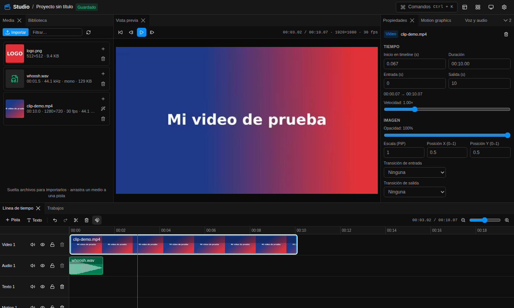
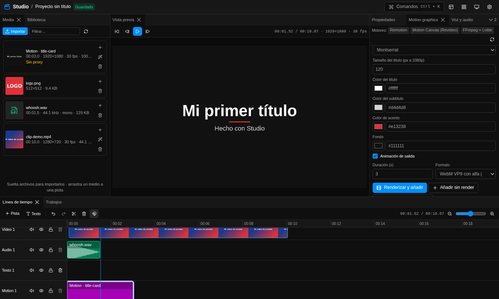
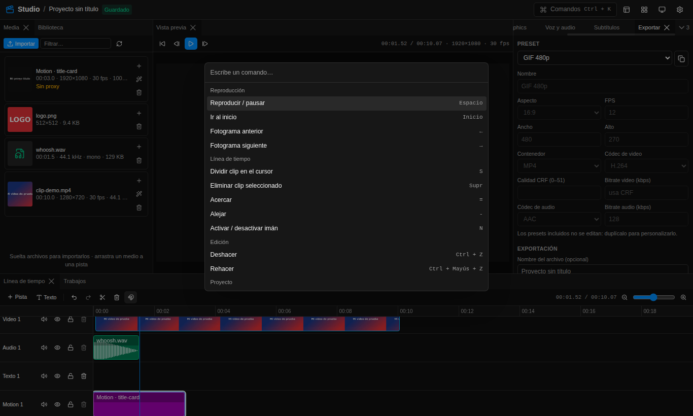
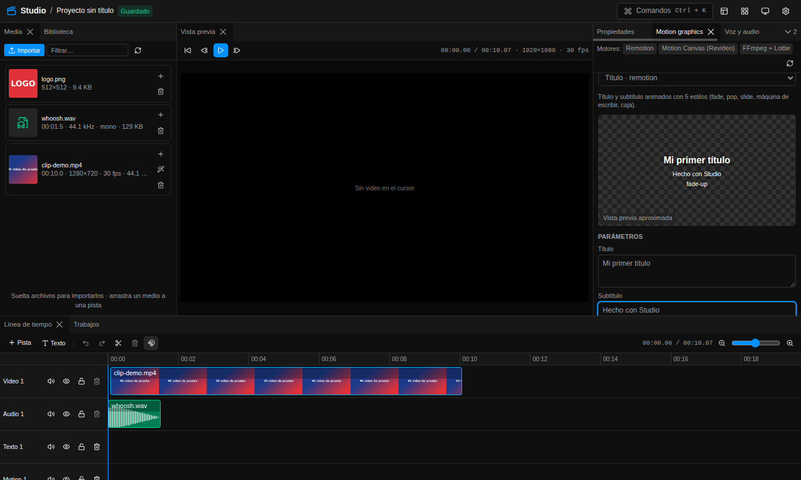
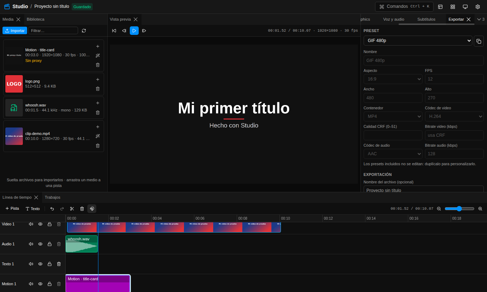
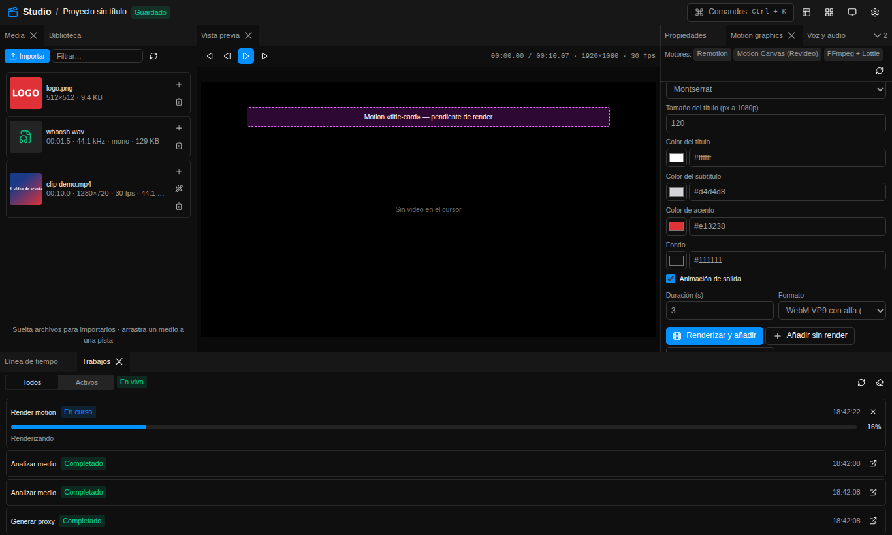

# Manual de usuario — Studio

> Versión 0.1.0 · Escrito para personas que **no** programan. Todo lo que aparece acá fue
> verificado contra el código del proyecto. Cuando algo no está limitado por el programa, se
> indica como **"sin límite impuesto; recomendado …"** con el motivo.
>
> Versión imprimible y navegable: [`index.html`](index.html) · PDF: [`MANUAL-USUARIO.pdf`](MANUAL-USUARIO.pdf)

## Índice

1. [Qué es y para qué sirve](#1-qué-es-y-para-qué-sirve)
2. [Requisitos](#2-requisitos)
3. [Instalación y arranque](#3-instalación-y-arranque)
4. [Recorrido por el dashboard](#4-recorrido-por-el-dashboard)
5. [Flujos paso a paso](#5-flujos-paso-a-paso)
6. [Formatos soportados](#6-formatos-soportados)
7. [Límites y recomendaciones](#7-límites-y-recomendaciones)
8. [Motion graphics: catálogo de plantillas](#8-motion-graphics-catálogo-de-plantillas)
9. [Voz: Piper, efectos y RVC](#9-voz-piper-efectos-y-rvc)
10. [Atajos de teclado](#10-atajos-de-teclado)
11. [Variables de `.env` que podés tocar](#11-variables-de-env-que-podés-tocar)
12. [Solución de problemas](#12-solución-de-problemas)
13. [Cómo reportar un error](#13-cómo-reportar-un-error)
14. [Pruebas que podés hacer hoy](#14-pruebas-que-podés-hacer-hoy)
15. [Limitaciones conocidas](#15-limitaciones-conocidas)
16. [Glosario](#16-glosario)

---

## 1. Qué es y para qué sirve

**Studio** es un editor de video que se usa desde el navegador pero corre **entero en tu PC**
(Windows 10/11). No necesita cuenta ni nube: el navegador habla con tres programas locales que se
abren con `start.ps1`.

Con Studio podés:

- **Editar video**: importar archivos, ponerlos en una línea de tiempo con pistas de video, audio,
  texto y motion; cortar, recortar, cambiar velocidad y volumen, poner transiciones y un video
  dentro de otro (PiP).
- **Hacer motion graphics** con 9 plantillas animadas (títulos, rótulos, subtítulos animados,
  pantalla final, etc.), con fondo transparente para superponerlas al video.
- **Trabajar la voz**: generar locuciones con voces en español (texto a voz, Piper), aplicar
  efectos (robot, teléfono, eco, voz grave…), limpiar y normalizar el volumen, y cambiar una voz
  por otra con modelos RVC.
- **Generar subtítulos automáticos** con Whisper, editarlos y quemarlos en el video.
- **Agregar efectos de sonido y música** desde una biblioteca local (con packs CC0 de Kenney y
  tus propios archivos; Freesound opcional).
- **Exportar** con presets listos: YouTube 1080p y 4K, Reels/TikTok, Shorts, GIF y WebM con
  transparencia, o crear los tuyos.

Cómo está armado (solo para entender los mensajes):

| Pieza       | Dirección               | Qué hace                                                         |
| ----------- | ----------------------- | ---------------------------------------------------------------- |
| **web**     | `http://localhost:3000` | El dashboard que ves en el navegador.                            |
| **api**     | `http://127.0.0.1:3001` | Guarda proyectos y archivos, maneja la cola de trabajos, FFmpeg. |
| **workers** | `http://127.0.0.1:8001` | Inteligencia artificial local: Whisper, Piper y RVC.             |

Todo escucha solo en `127.0.0.1` (tu propia PC): nadie de tu red puede entrar.

## 2. Requisitos

| Requisito     | Mínimo                                         | Recomendado                                                                                          |
| ------------- | ---------------------------------------------- | ---------------------------------------------------------------------------------------------------- |
| Sistema       | Windows 10 (21H2 o superior) u 11, **64 bits** | Windows 11                                                                                           |
| Memoria (RAM) | 8 GB                                           | 16 GB                                                                                                |
| Disco libre   | 10 GB para la instalación                      | 20 GB (+4 GB si instalás CUDA) + espacio para tus proyectos (ver [§7](#7-límites-y-recomendaciones)) |
| GPU           | **No hace falta**: todo funciona en CPU        | NVIDIA con driver 570 o superior (acelera Whisper y RVC)                                             |
| Navegador     | Microsoft Edge o Google Chrome                 | Chrome/Edge actualizados                                                                             |
| Internet      | Solo para instalar y para descargar modelos    | —                                                                                                    |

Notas:

- **Internet**: se usa durante `setup.ps1` (programas, dependencias, voz Piper, modelo Whisper,
  activos de RVC, navegador de Remotion) y cuando pedís algo que no está descargado (por ejemplo, un
  modelo Whisper distinto o una voz nueva). Las API de ElevenLabs, OpenAI y Freesound son
  **opcionales** y solo se usan si ponés su clave.
- **GPU**: el codificador de video por hardware (NVIDIA NVENC, Intel QuickSync o AMD AMF) se detecta
  solo para exportar H.264; si falla, Studio vuelve al codificador por CPU (`libx264`).
- **Navegador**: usá Chrome o Edge. Chromium "pelado" no reproduce H.264 en la vista previa.

## 3. Instalación y arranque

La guía completa, con la solución de los errores típicos de instalación, está en
**[Instalación en Windows](../INSTALACION-WINDOWS.md)**. Resumen:

1. Descargá el proyecto (ZIP o `git clone`) a una **ruta corta**, por ejemplo `C:\dev\studio`.
   Si bajaste el ZIP, desbloqueá los scripts:
   `Get-ChildItem -Recurse C:\dev\studio\scripts | Unblock-File`
2. Abrí **Windows PowerShell** (no hace falta como administrador) y entrá a la carpeta:
   `cd C:\dev\studio`
3. Instalá todo (15–40 minutos según tu conexión; aceptá los avisos de Control de cuentas):

   ```powershell
   powershell -NoProfile -ExecutionPolicy Bypass -File scripts\windows\setup.ps1
   ```

   Con GPU NVIDIA agregá `-WithCuda` (también acepta `-Cuda`). Al final verás una tabla con ✅/❌.

4. Arrancá Studio (o doble clic en `scripts\windows\start.cmd`):

   ```powershell
   powershell -NoProfile -ExecutionPolicy Bypass -File scripts\windows\start.ps1
   ```

   Se abren tres ventanas (workers, api, web) y el navegador en <http://localhost:3000>.

5. Para cerrar: cerrá esas ventanas o ejecutá `scripts\windows\stop.ps1`.

Opciones de los scripts (verificadas en `scripts/windows/*.ps1`):

| Script                                  | Opción                                      | Para qué                                                                                  |
| --------------------------------------- | ------------------------------------------- | ----------------------------------------------------------------------------------------- |
| `setup.ps1`                             | `-WithCuda` (alias `-Cuda`)                 | Instala PyTorch con CUDA 12.8 y pone `USE_CUDA=true` en `.env`.                           |
| `setup.ps1`                             | `-WhisperModel small`                       | Descarga otro modelo de subtítulos (por defecto `base`).                                  |
| `setup.ps1`                             | `-PiperVoice es_MX-claude-high`             | Descarga otra voz (por defecto la de `PIPER_DEFAULT_VOICE`).                              |
| `setup.ps1`                             | `-SkipRvc`                                  | Instalación liviana sin PyTorch/RVC (RVC queda deshabilitado).                            |
| `setup.ps1`                             | `-SkipModels`, `-SkipBrowser`, `-SkipBuild` | Saltea descargas de modelos, el navegador de Remotion o la compilación.                   |
| `setup.ps1`                             | `-SkipWinget`                               | No instala nada con winget (Git, Node 22, Python 3.11 y FFmpeg ya en PATH).               |
| `start.ps1`                             | `-SingleConsole`                            | Todo en una sola consola con prefijos `[workers]`, `[api]`, `[web]`; Ctrl+C detiene todo. |
| `start.ps1`                             | `-NoBrowser`                                | No abre el navegador.                                                                     |
| `start.ps1`                             | `-TimeoutSec 300`                           | Espera más por cada servicio (por defecto 180 s).                                         |
| `start.ps1`                             | `-Dev`                                      | Modo desarrollo (recarga en caliente). No hace falta para usar Studio.                    |
| `doctor.ps1`                            | —                                           | Diagnóstico de versiones, FFmpeg, GPU, modelos, puertos y servicios. No cambia nada.      |
| `stop.ps1`                              | —                                           | Detiene lo que levantó `start.ps1`.                                                       |
| `import-cc0.ps1` (en `scripts\library`) | `-ZipDir`, `-Packs`, `-Force`, `-NoScan`    | Descarga packs de sonidos CC0 de Kenney a la biblioteca.                                  |

## 4. Recorrido por el dashboard



La pantalla tiene un **encabezado** arriba y debajo los **paneles**, que podés mover, agrupar en
pestañas, redimensionar y ocultar.

### 4.1 Encabezado

De izquierda a derecha:

- **Studio / nombre del proyecto** y un indicador de guardado: _Cambios sin guardar_,
  _Guardando…_, _Guardado_, _Guardado local_ (la API no responde: se guardó solo en este
  navegador) o _Error al guardar_.
- **Comandos** (`Ctrl+K`): abre la paleta de comandos.
- **Paneles** (ícono de paneles): mostrar u ocultar cada panel.
- **Layouts** (ícono de cuadrícula): _Restaurar layout_, _Guardar layout actual…_, tus layouts
  guardados y _Gestionar layouts…_.
- **Tema** (sol / luna / monitor): Claro, Oscuro o Sistema.
- **Ajustes** (engranaje): pestañas _Apariencia_, _Atajos_ y _Layouts_.
- **🐞 Reportar error**: abre el formulario de reporte (ver [§13](#13-cómo-reportar-un-error)).

### 4.2 Los 10 paneles

| Panel               | Para qué sirve                                                                                                                                                                                                                                                                                                                                       |
| ------------------- | ---------------------------------------------------------------------------------------------------------------------------------------------------------------------------------------------------------------------------------------------------------------------------------------------------------------------------------------------------- |
| **Media**           | Importar archivos (botón **Importar** o arrastrar y soltar), ver miniatura y datos (duración, resolución, fps, tamaño), **+** para agregar a la línea de tiempo, varita para **Generar proxy**, tacho para borrar, filtro por nombre.                                                                                                                |
| **Biblioteca**      | Buscar efectos de sonido y música (_Efectos_, _Música_, _Ambiente_), escucharlos, **+** para agregarlos a la línea de tiempo, **Re-escanear** la carpeta de la biblioteca y **subir** sonidos propios.                                                                                                                                               |
| **Vista previa**    | Reproductor sincronizado con el cursor de la línea de tiempo: ir al inicio, fotograma anterior/siguiente, reproducir/pausar. Muestra el clip bajo el cursor (usa el proxy si existe), el audio, los textos, los subtítulos y los motion ya renderizados.                                                                                             |
| **Línea de tiempo** | Pistas y clips. Barra: **Pista** (agregar pista de video, audio, texto o motion), **Texto** (clip de texto en el cursor), deshacer/rehacer, tijera (**dividir** en el cursor), tacho, **imán**, tiempo actual / total y zoom.                                                                                                                        |
| **Propiedades**     | Sin clip seleccionado: nombre y tamaño del proyecto (ancho, alto, FPS y botones _16:9 1080p_, _9:16 vertical_, _1:1_) y datos del medio seleccionado. Con un clip: tiempo (inicio, entrada, salida, velocidad), imagen (opacidad, escala y posición PiP, transiciones), audio (volumen, efectos guardados), texto (fuente, tamaño, color, posición). |
| **Motion graphics** | Elegir plantilla, editar parámetros, duración y formato; **Renderizar y añadir**, **Añadir sin render** o **Actualizar clip y renderizar**. Arriba se ve qué motores están disponibles (en verde); las plantillas de un motor no disponible no se pueden elegir.                                                                                     |
| **Voz y audio**     | Tres pestañas: **Texto a voz**, **Efectos** y **RVC**.                                                                                                                                                                                                                                                                                               |
| **Subtítulos**      | **Transcribir (Whisper)** el clip seleccionado (idioma y modelo), editar segmentos, **Descargar SRT**, elegir **estilo** y **Renderizar subtítulos como motion**.                                                                                                                                                                                    |
| **Exportar**        | Elegir preset (arranca en _YouTube 1080p_), duplicarlo y editarlo (incluida la casilla **Transparencia**), nombre del archivo, exportar un rango, **Quemar subtítulos en el video** y la lista de **Exportaciones recientes** con **Descargar**.                                                                                                     |
| **Trabajos**        | Todo lo que tarda (análisis, proxies, renders, voz, transcripción, exportación) con su progreso. Permite cancelar, abrir el resultado, filtrar _Todos/Activos_, limpiar terminados y, en los que fallan, **Reportar**. Arriba indica la conexión: _En vivo_, _Consulta periódica_ o _Sin conexión_.                                                  |

Cómo se trabaja en la **línea de tiempo**:

- **Mover** un clip: arrastralo (puede pasar a otra pista del mismo tipo).
- **Recortar**: arrastrá los bordes del clip.
- **Dividir**: poné el cursor y tocá `S` (o la tijera).
- **Zoom**: `Ctrl` + rueda del mouse, el control deslizante o las teclas `=` y `-`.
- **Imán** (`N`): pega los clips al 0, al cursor y a los bordes de otros clips.
- Cada pista tiene botones para **silenciar**, **ocultar**, **bloquear** y **eliminar** (solo se
  elimina si está vacía).
- **Orden de las capas**: las pistas se apilan en el orden de la lista; la pista de **más arriba
  queda al fondo** de la imagen y las que agregás después quedan **encima**. (No hay forma de
  reordenar pistas desde la interfaz.)
- Hasta **100 pasos** de deshacer/rehacer.



### 4.3 Personalizar

- **Mover paneles**: arrastrá la pestaña del panel a otro lugar (al centro de otro grupo para
  sumarlo como pestaña, o a un borde para dividir). Los bordes entre paneles se arrastran para
  cambiar el tamaño.
- **Ocultar / mostrar**: menú **Paneles** del encabezado o, en la paleta, _Mostrar panel: …_ /
  _Ocultar panel: …_.
- **Layouts guardados**: menú **Layouts → Guardar layout actual…** y escribí un nombre. Los ves en
  el mismo menú y en **Ajustes → Layouts** (Aplicar, eliminar). **Restaurar layout**
  (`Ctrl+Shift+R`) vuelve a la distribución original.
- **Apariencia** (Ajustes → Apariencia): tema Claro/Oscuro/Sistema, **color de acento** (muestras
  o _Personalizado_) y **densidad** Compacta/Cómoda/Amplia.
- **Atajos** (Ajustes → Atajos): hacé clic en un atajo y apretá la nueva combinación; `Esc`
  cancela y `Retroceso` lo deja vacío. Si dos acciones usan la misma tecla aparece el aviso
  _Hay atajos repetidos_. **Restablecer** vuelve a los de fábrica.
- **Paleta de comandos** (`Ctrl+K` o botón **Comandos**): escribí parte del nombre y Enter.
  Incluye todas las acciones con atajo, mostrar/ocultar/ir a cada panel, aplicar layouts, cambiar
  tema, abrir ajustes, agregar pistas, _Añadir clip de texto en el cursor_, _Nuevo proyecto_ y
  _Reportar error (diagnóstico para Claude)_ (ver [§13](#13-cómo-reportar-un-error)).

Dónde se guarda: los ajustes y el layout se guardan en el navegador **y** en la API local (gana la
copia más nueva), así sobreviven a borrar el historial del navegador.



### 4.4 Guardado del proyecto

- Studio trabaja con **un proyecto abierto a la vez**. Cada cambio se guarda solo (a los 1,5 s) en
  el navegador y en la API. `Ctrl+S` fuerza el guardado.
- **Nuevo proyecto** (paleta) reemplaza el proyecto abierto por uno vacío de 1920×1080 a 30 fps con
  cuatro pistas (video, audio, texto, motion). **No hay una lista para volver a abrir proyectos
  anteriores** desde la interfaz: exportá antes de empezar otro.

## 5. Flujos paso a paso

### Flujo 1 — Cortar y exportar un clip

1. En **Media**, tocá **Importar** (o arrastrá el archivo al panel). Esperá en **Trabajos** a que
   terminen _Analizar medio_ y _Generar proxy_.
2. Tocá **+** en el medio (o arrastralo a la pista de video). El clip arranca en el cursor.
3. Llevá el cursor al punto de corte (clic en la regla o `←`/`→` fotograma a fotograma) y tocá `S`.
4. Seleccioná la parte que no querés y apretá `Supr`. Repetí para el final.
5. Si quedó un hueco al principio, seleccioná el clip y en **Propiedades → Tiempo** poné
   _Inicio en timeline (s)_ en `0`. Para recortes exactos usá _Entrada (s)_ y _Salida (s)_.
6. Abrí **Exportar** (`Ctrl+E`), elegí **YouTube 1080p (16:9)**, escribí un nombre (opcional) y
   tocá **Exportar**.
7. Cuando el trabajo diga _Completado_, tocá **Descargar** en _Exportaciones recientes_. El archivo
   también queda en `storage\exports\<nombre>-<fecha>.mp4`.

Tip: para exportar solo un tramo sin cortar, marcá _Exportar solo un rango_ y completá
_Desde (s)_ / _Hasta (s)_.

### Flujo 2 — Video vertical para Reels/TikTok con subtítulos animados

**Decidí primero el lienzo** (Propiedades, sin clip seleccionado):

- **Video grabado vertical**: tocá **9:16 vertical** (1080×1920).
- **Video horizontal**: dejá el proyecto en 16:9. Al exportar con el preset vertical, Studio pone
  el cuadro completo centrado con un **fondo desenfocado** arriba y abajo. (Si en cambio ponés el
  proyecto en 9:16 con un video horizontal, el video queda con **barras negras**: no hay recorte ni
  zoom en la interfaz.)

Pasos:

1. Importá el video y agregalo a la pista de video (como en el flujo 1).
2. Seleccioná el clip. En **Subtítulos → Transcribir (Whisper)** elegí _Idioma_ (Español) y
   _Modelo_ (_Por defecto_ usa `WHISPER_MODEL` de `.env`) y tocá **Transcribir clip**.
3. Cuando termine, los segmentos aparecen en la lista. Corregí el texto que haga falta (al
   editar un segmento se pierden los tiempos por palabra de ese segmento) y ajustá _Estilo de
   subtítulos_: los presets _Clásico_, _Reels (palabra a palabra)_, _Karaoke_, _Minimal_ y
   _Titular arriba_, más tamaño, posición, colores, animación y mayúsculas.
4. **Subtítulos simples (quemados)**: con eso alcanza. Al exportar, con la casilla
   **Quemar subtítulos en el video** marcada, los segmentos se queman con FFmpeg usando la fuente,
   tamaño, color, posición y mayúsculas del estilo (sin animación).
5. **Subtítulos animados (palabra a palabra)**: tocá **Renderizar subtítulos como motion**. Se
   crea un clip en la pista **Motion** con la plantilla _Subtítulos animados_ que empieza donde
   empieza el primer segmento, y se renderiza con fondo transparente (mirá **Trabajos**). Para
   cambiar el estilo de la animación (`highlight`, `karaoke`, `pop`, `box`), seleccioná ese clip,
   tocá _Editar el clip motion seleccionado_ en **Motion graphics** y **Actualizar clip y
   renderizar**. Cuando hay un clip de subtítulos animados, la casilla **Quemar subtítulos en el
   video** del panel Exportar arranca **desmarcada**, así no salen dos veces.
6. Exportá con **Reels / TikTok (9:16)** (1080×1920, 30 fps) o **YouTube Shorts (9:16)**
   (1080×1920, 60 fps).

### Flujo 3 — Locución con TTS + música con ducking

**Generar la voz**

1. Llevá el cursor a donde querés que empiece la voz.
2. **Voz y audio → Texto a voz**: _Proveedor_ **Piper (local)**, elegí la _Voz_, escribí el
   _Texto_ (hasta 20 000 caracteres), ajustá _Velocidad_ (0,5× a 2×) y tocá
   **Generar y añadir al cursor**. El audio aparece en una pista de audio.
3. Opcional: seleccioná el clip y en **Efectos** usá el preset **Voz limpia** (reducción de ruido +
   normalización a −16 LUFS) → **Aplicar (crea un nuevo audio)**.

**Agregar la música**

4. Importá la música en **Media** (o buscala en **Biblioteca** con el filtro _Música_) y agregala.
   Queda en otra pista de audio.

**Bajar la música bajo la voz — dos opciones**

- **Opción A, desde el dashboard (sin ducking automático)**: seleccioná el clip de música y en
  **Propiedades → Audio** bajá el _Volumen_ (por ejemplo al 20–30 %). Si querés que suba en las
  pausas, dividí la música (`S`) y poné volúmenes distintos a cada parte.
- **Opción B, ducking automático (avanzado)**: el efecto _ducking_ existe en el motor de audio pero
  **no tiene botón en el dashboard** (ver [§15](#15-limitaciones-conocidas)). Se pide a la API
  desde PowerShell y genera un único audio con la voz + la música que baja sola cuando hay voz:
  1. Averiguá los identificadores: clic en el medio de la voz en **Media** (sin clip seleccionado
     en la línea de tiempo) y mirá en **Propiedades → Medio seleccionado** la ruta
     `media/<ID>.<ext>`; hacé lo mismo con la música.
  2. En PowerShell:

     ```powershell
     $body = @{
       assetId = "ID_DE_LA_VOZ"
       format  = "wav"
       effects = @(@{ type = "ducking"; musicAssetId = "ID_DE_LA_MUSICA";
                      threshold = 0.05; ratio = 8; attackMs = 20; releaseMs = 400; musicVolume = 1 })
     } | ConvertTo-Json -Depth 5
     Invoke-RestMethod -Method Post -Uri http://127.0.0.1:3001/api/voice/effects `
       -ContentType 'application/json' -Body $body
     ```

  3. Aparece un trabajo _Efecto de voz_. Al terminar, en **Media** (botón recargar) hay un audio
     nuevo llamado `<nombre de la voz> (efecto)`. Reemplazá los dos clips por ese.
  - `threshold` (0,000977–1): desde qué nivel de voz baja la música. `ratio` (1–20): cuánto baja.
    `attackMs`/`releaseMs`: qué tan rápido baja y vuelve. `musicVolume` (0–4): volumen base de la
    música. El audio resultante dura lo que el más largo de los dos.

### Flujo 4 — Cambiar la voz con RVC

1. Conseguí un modelo RVC **ya entrenado** (Studio no entrena modelos) y copialo en
   `models\rvc\<nombre>\` (ver [§9.3](#93-rvc-conversión-de-voz)). Recargá la página.
2. Seleccioná en la línea de tiempo el clip con la voz original.
3. **Voz y audio → RVC**: elegí _Modelo_, _Cambio de tono_ (−24 a +24 semitonos; +12 suele usarse
   para pasar de voz masculina a femenina y −12 al revés), _Índice de rasgos_ (0 a 1, por defecto
   0,75), _Método F0_ (**rmvpe** recomendado, **pm** más rápido, harvest, crepe) y, si está
   habilitado, _Usar GPU (CUDA)_.
4. Tocá **Convertir voz**. En CPU tarda (ver [§7](#7-límites-y-recomendaciones)). Al terminar, el
   clip pasa a usar el audio convertido.

Usá solo voces propias o con permiso explícito de la persona.

### Flujo 5 — Título, lower-third y pantalla final con Remotion

1. Llevá el cursor a donde va el gráfico.
2. **Motion graphics → Plantilla**: elegí **Título**, **Rótulo (lower third)** o
   **Pantalla final (CTA)** (todas del motor `remotion`).
3. Editá los _Parámetros_ (textos, estilo, tipografía, colores). El **Título** ya viene con _Fondo_
   `transparent`; en otras plantillas, para que se superpongan al video, escribí `transparent` en el
   campo de texto de _Fondo_ (el selector de color solo elige colores).
4. _Formato_: **WebM VP9 con alfa (overlay)** para usarlo dentro de Studio. _Duración (s)_: por
   defecto 3 s (título), 5 s (rótulo) y 8 s (pantalla final).
5. Tocá **Renderizar y añadir**: se crea el clip en la pista **Motion** y se renderiza (mirá
   **Trabajos → Render motion**). La vista del panel es aproximada; cuando termina aparece el
   video del último render.
6. Para cambiarlo: seleccioná el clip, tocá _Editar el clip motion seleccionado_, cambiá los
   parámetros y **Actualizar clip y renderizar**.

Si un clip motion dice _Sin renderizar_ en Propiedades, **la exportación se niega a empezar** y
te dice qué clip falta renderizar.



### Flujo 6 — Agregar efectos de sonido desde la biblioteca

1. Una vez: cargá sonidos. Opciones:
   - Packs CC0 de Kenney:
     `powershell -NoProfile -ExecutionPolicy Bypass -File scripts\library\import-cc0.ps1`
   - Copiá tus archivos a `storage\library\sfx\`, `music\` o `ambience\` (las subcarpetas se
     vuelven etiquetas) y tocá **Re-escanear** en **Biblioteca**.
   - O usá el botón de subir de **Biblioteca** (los archivos subidos entran como _Efectos_ con
     licencia "unknown").
2. En **Biblioteca**, escribí en _Buscar sonidos y música…_ (por ejemplo `click`, `puerta`),
   filtrá por tipo y proveedor (_Local_ o Freesound si configuraste la clave).
3. Tocá ▶ para escuchar y **+** para agregarlo a la línea de tiempo.
4. Movelo al momento justo y ajustá su volumen en **Propiedades → Audio**.

La licencia y la atribución de cada sonido se ven en la lista. Si la licencia pide atribución
(por ejemplo CC-BY), poné el crédito en la descripción de tu video.

### Flujo 7 — Exportar en varios formatos

1. Abrí **Exportar** (arranca en **YouTube 1080p (16:9)**) y elegí un preset de la tabla de [§6.2](#62-salida-presets-de-exportación).
2. Para un formato propio: elegí uno parecido, tocá **Duplicar preset** y cambiá _Nombre_,
   _Aspecto_, _Ancho_, _Alto_, _FPS_, _Contenedor_, _Códec de video_, _Calidad CRF (0–51)_ o
   _Bitrate video (kbps)_ (si lo completás, se ignora el CRF), _Códec de audio_,
   _Bitrate audio (kbps)_ y **Transparencia** (canal alfa: WebM VP9 o ProRes 4444). Tocá
   **Guardar preset**.
   - Los presets incluidos no se editan ni se borran: duplicalos.
   - Combinaciones que funcionan: **MP4 + H.264 o H.265 + AAC**, **WebM + VP9** (el audio pasa
     siempre a Opus), **MOV + ProRes + AAC o PCM**.
   - Ejemplos útiles: Instagram 4:5 (1080×1350), cuadrado 1:1 (1080×1080), H.265 para archivos
     más chicos, ProRes para llevar a otro editor.
3. Exportá una vez por preset. Cada exportación es un trabajo nuevo y un archivo nuevo en
   `storage\exports\`.
4. **Con transparencia**: el preset **WebM con transparencia (VP9)** (o uno tuyo con la casilla
   **Transparencia** y códec VP9 o ProRes) deja transparente lo que no
   tiene imagen (útil para exportar solo gráficos). Si hay un video ocupando todo el cuadro, no
   va a quedar nada transparente.
5. **GIF 480p**: 480×270 a 12 fps, sin audio, en bucle.



## 6. Formatos soportados

### 6.1 Entrada (lo que podés importar en Media)

El tipo se decide por la **extensión** del archivo (`apps/api/src/services/media-files.ts`).

| Tipo                  | Extensiones aceptadas                                                       | Qué hace Studio                                                                                                                                         |
| --------------------- | --------------------------------------------------------------------------- | ------------------------------------------------------------------------------------------------------------------------------------------------------- |
| Video                 | mp4, mov, mkv, webm, avi, m4v, mts, m2ts, ts, wmv, flv, mpg, mpeg, 3gp, gif | Analiza (duración, resolución, fps, audio), miniatura, tira de miniaturas, forma de onda y **proxy 360p** automático.                                   |
| Audio                 | mp3, wav, m4a, aac, flac, ogg, opus, wma, aif, aiff                         | Analiza y calcula la forma de onda.                                                                                                                     |
| Imagen                | png, jpg, jpeg, webp, bmp, tif, tiff                                        | Se usa como clip de video fijo (dura lo que estires el clip).                                                                                           |
| Subtítulos            | srt, ass, vtt                                                               | Se guardan en Media, pero **hoy no se cargan** en el panel Subtítulos ni se queman (ver [§15](#15-limitaciones-conocidas)).                             |
| Lottie                | json, lottie                                                                | Se guardan en Media. Para animarlos usá la plantilla **Animación Lottie** con la URL del archivo (ver [§8](#8-motion-graphics-catálogo-de-plantillas)). |
| Biblioteca de sonidos | wav, mp3, ogg, oga, opus, flac, m4a, aac                                    | Se indexan con búsqueda, etiquetas, licencia y forma de onda.                                                                                           |
| Modelos RVC           | `.pth` (obligatorio) + `.index` (opcional) en `models\rvc\<nombre>\`        | Aparecen en **Voz y audio → RVC**.                                                                                                                      |
| Voces Piper           | `<voz>.onnx` + `<voz>.onnx.json` en `models\piper\`                         | Aparecen en **Texto a voz**.                                                                                                                            |

Si el archivo no tiene extensión reconocida pero el navegador informa un tipo `video/*`, `audio/*`
o `image/*`, también se acepta. Cualquier otro tipo da _Tipo de archivo no soportado_.

### 6.2 Salida: presets de exportación

| Preset                       | Contenedor | Video            | Resolución | FPS | Calidad | Audio         | Alfa |
| ---------------------------- | ---------- | ---------------- | ---------- | --- | ------- | ------------- | ---- |
| YouTube 1080p (16:9)         | MP4        | H.264            | 1920×1080  | 30  | CRF 20  | AAC 192 kbps  | No   |
| YouTube 4K (16:9)            | MP4        | H.264            | 3840×2160  | 30  | CRF 18  | AAC 192 kbps  | No   |
| Reels / TikTok (9:16)        | MP4        | H.264            | 1080×1920  | 30  | CRF 21  | AAC 160 kbps  | No   |
| YouTube Shorts (9:16)        | MP4        | H.264            | 1080×1920  | 60  | CRF 20  | AAC 192 kbps  | No   |
| GIF 480p                     | GIF        | GIF (paleta)     | 480×270    | 12  | —       | sin audio     | No   |
| WebM con transparencia (VP9) | WebM       | VP9 (`yuva420p`) | 1920×1080  | 30  | CRF 30  | Opus 160 kbps | Sí   |

Detalles:

- Audio siempre a 48 kHz. MP4 y MOV salen con _faststart_ (empiezan a reproducirse antes de
  descargarse del todo).
- **H.264** usa el codificador por hardware si existe (NVENC, QuickSync o AMF) o `libx264`
  (preset _medium_, perfil _high_). **H.265** usa `libx265` (CPU). **VP9** usa `libvpx-vp9`.
  **ProRes** usa `prores_ks` (perfil HQ; 4444 con alfa).
- Si el aspecto del proyecto y del preset difieren, el cuadro entra completo con **fondo
  desenfocado** (o con bordes transparentes si el preset tiene alfa).
- Subtítulos: se queman si está marcada **Quemar subtítulos en el video** (por defecto sí, salvo
  que haya un clip de _Subtítulos animados_).
- Nombre del archivo: `storage\exports\<nombre-o-proyecto>-<AAAAMMDD-HHMMSS>.<ext>`.

### 6.3 Salida de motion graphics

| Formato (panel Motion)      | Archivo           | Alfa | Uso                                                  |
| --------------------------- | ----------------- | ---- | ---------------------------------------------------- |
| MP4 H.264 (sin alfa)        | `.mp4`            | No   | Gráfico con fondo propio.                            |
| WebM VP9 con alfa (overlay) | `.webm`           | Sí   | **Recomendado** para usar en Studio.                 |
| ProRes 4444 con alfa        | `.mov`            | Sí   | Llevar a otro editor (Premiere, Resolve, Final Cut). |
| Secuencia PNG               | carpeta de `.png` | Sí   | Otros programas de composición.                      |

Se guardan en `storage\renders\<id-del-trabajo>.<ext>`.

### 6.4 Salida de voz y subtítulos

| Función        | Archivo                                                                                |
| -------------- | -------------------------------------------------------------------------------------- |
| Texto a voz    | WAV en `storage\renders\` (nuevo medio de audio).                                      |
| Efectos de voz | WAV 48 kHz (la API también acepta MP3 y M4A).                                          |
| RVC            | Audio nuevo en `storage\renders\`.                                                     |
| Transcripción  | JSON + SRT + ASS (karaoke) en `storage\renders\`; botón **Descargar SRT** en el panel. |

## 7. Límites y recomendaciones

**Impuestos por el programa** (si los superás, Studio muestra un error):

| Qué                                  | Límite                                                            |
| ------------------------------------ | ----------------------------------------------------------------- |
| Tamaño de cada archivo importado     | 20 GB (error _El archivo supera el límite_).                      |
| Proyecto guardado (JSON)             | 10 MB por pedido a la API (un proyecto normal pesa unos KB).      |
| Texto a voz                          | 20 000 caracteres por pedido; velocidad 0,5× a 2×.                |
| Velocidad de un clip                 | 0,1× a 4× en Propiedades.                                         |
| Volumen de un clip                   | 0 % a 400 %.                                                      |
| Transiciones                         | 0,05 a 10 s.                                                      |
| Escala PiP / posición                | Escala 0,05 a 1; posición X/Y 0 a 1.                              |
| Motion graphics (Remotion)           | Hasta 1800 s (30 min) y 120 fps por render.                       |
| Motion graphics (FFmpeg)             | Hasta 600 s y 60 fps.                                             |
| RVC                                  | Tono −24 a +24 semitonos; índice 0 a 1.                           |
| Deshacer                             | 100 pasos.                                                        |
| Trabajos simultáneos                 | FFmpeg 2 (1–8), motion 1 (1–4), IA 1 (1–4); se cambian en `.env`. |
| Trabajo interrumpido por un reinicio | Se reintenta solo hasta 2 intentos; después queda _Falló_.        |

**Sin límite impuesto** (recomendaciones y por qué):

| Qué                           | Recomendado                                                   | Por qué                                                                                                                              |
| ----------------------------- | ------------------------------------------------------------- | ------------------------------------------------------------------------------------------------------------------------------------ |
| Duración del video            | Sin límite impuesto; recomendado ≤ 30 min por proyecto        | La exportación arma un único proceso FFmpeg con todo el proyecto: proyectos largos tardan mucho y si falla hay que empezar de nuevo. |
| Resolución                    | Sin límite impuesto; recomendado ≤ 4K (3840×2160)             | Es la mayor resolución de los presets incluidos; más allá FFmpeg usa mucha memoria.                                                  |
| Cantidad de pistas            | Sin límite impuesto; recomendado ≤ 6 pistas de video/motion   | Cada pista visual se superpone en el mismo proceso de exportación: más pistas = más RAM y más tiempo.                                |
| Cantidad de clips             | Sin límite impuesto; recomendado ≤ 200                        | El proyecto se guarda completo cada 1,5 s y el historial de deshacer guarda copias.                                                  |
| Archivos de la Biblioteca     | Sin límite impuesto (20 GB); recomendado ≤ 100 MB por archivo | Las subidas a la Biblioteca se cargan enteras en memoria antes de guardarse.                                                         |
| Motion graphics               | Recomendado ≤ 60 s por render                                 | El render en CPU con navegador es lento; para piezas largas conviene dividir.                                                        |
| RVC                           | Recomendado clips ≤ 1 min en CPU                              | En CPU tarda del orden de la duración del audio o más.                                                                               |
| Texto a voz                   | Recomendado ≤ 1000 caracteres por bloque                      | Un error a mitad de un texto largo obliga a repetir todo; en bloques es más fácil corregir.                                          |
| Espacio en disco por proyecto | Recomendado: 3 veces el tamaño de tus originales libre        | Studio guarda el original, un proxy, renders intermedios y cada exportación (no se borran solos).                                    |

**Tiempos esperados en CPU** (orientativos; **no medidos en este proyecto**: medilos con las
recetas de [§14](#14-pruebas-que-podés-hacer-hoy)):

| Tarea                  | Referencia                                                                                                                                                                                                      |
| ---------------------- | --------------------------------------------------------------------------------------------------------------------------------------------------------------------------------------------------------------- |
| Whisper `small` (int8) | 13 min de audio en ≈ 1 min 42 s en un i7-12700K (benchmark publicado de faster-whisper). `base` es más rápido; `medium` ≈ 3 veces más lento que `small`; `large-v3` en CPU es poco práctico para videos largos. |
| Texto a voz (Piper)    | Más rápido que tiempo real (según la documentación de Piper).                                                                                                                                                   |
| RVC                    | Del orden de la duración del audio o más; con `-WithCuda` es varias veces más rápido.                                                                                                                           |
| Remotion               | Sin dato medido. Usa por defecto la mitad de los hilos de tu CPU (`REMOTION_CONCURRENCY`).                                                                                                                      |
| Exportación            | Depende de la duración, la resolución y si hay codificador por hardware. H.265, VP9 y 4K son los más lentos.                                                                                                    |

**Espacio en disco**:

- Instalación: 10 GB mínimo, 20 GB recomendado, +4 GB con CUDA (PyTorch CUDA ≈ 3 GB).
- Modelos: se guardan en `models\` (Whisper, Piper, RVC). Cada modelo Whisper extra ocupa más
  espacio cuanto más grande es.
- Tus datos: `storage\media` (originales), `storage\proxies` (proxies y miniaturas),
  `storage\renders` (voz, motion, transcripciones), `storage\exports` (exportaciones). Podés borrar
  `storage\tmp` con Studio cerrado. Borrar un medio desde Media borra también su proxy y
  miniaturas, pero **no** los renders ni las exportaciones.

## 8. Motion graphics: catálogo de plantillas

Todas las plantillas Remotion admiten fondo `transparent` salvo **Transición entre clips**. Las
tipografías disponibles son: Inter, Montserrat, Poppins, Roboto, Oswald, Playfair Display,
Bebas Neue, Anton, Archivo Black y Bangers (con `REMOTION_FONTS=system`, el valor por defecto, se
usan las fuentes instaladas en Windows y no se descarga nada). Los colores aceptan `#rrggbb`,
`rgba(...)`, nombres CSS y `transparent`.

| #   | Plantilla (id)                                 | Duración por defecto | Para qué                                                                 |
| --- | ---------------------------------------------- | -------------------- | ------------------------------------------------------------------------ |
| 1   | **Título** (`title-card`)                      | 3 s                  | Título + subtítulo con 5 estilos de animación.                           |
| 2   | **Rótulo (lower third)** (`lower-third`)       | 5 s                  | Nombre y cargo con entrada y salida configurables.                       |
| 3   | **Subtítulos animados** (`animated-captions`)  | 5 s                  | Subtítulos palabra a palabra estilo TikTok/CapCut.                       |
| 4   | **Transición entre clips** (`transition`)      | 4 s                  | Une dos medios con fundido, deslizamiento, barrido o giro. Sin alfa.     |
| 5   | **Visualizador de audio** (`audio-visualizer`) | 10 s                 | Barras u onda que reaccionan a un audio, con título.                     |
| 6   | **Animación Lottie** (`lottie-overlay`)        | 3 s                  | Superpone una animación Lottie con fondo transparente.                   |
| 7   | **Pantalla final (CTA)** (`end-screen`)        | 8 s                  | Cierre con llamada a la acción, usuario y recuadros de videos sugeridos. |
| 8   | **Barra de progreso** (`progress-bar`)         | 10 s                 | Barra del avance del video, con capítulos opcionales.                    |
| 9   | **Tipografía cinética** (`kinetic-typography`) | 4 s                  | Texto que entra palabra por palabra con animaciones de impacto.          |

Parámetros (nombre en el panel → valores; **negrita** = por defecto):

1. **Título**: Título (**Mi título**), Subtítulo, Estilo (**fade-up**, pop, slide, typewriter,
   boxed), Alineación (**center**, left), Tipografía (**Montserrat**), Tamaño del título (16–400,
   **120**), Color del título, Color del subtítulo, Color de acento, Fondo (**transparent**), Animación
   de salida (**sí**).
2. **Rótulo**: Nombre, Cargo / descripción, Estilo (**bar**, box, underline, split), Posición
   (**bottom-left**, bottom-center, bottom-right, top-left, top-right), Animación de entrada
   (**slide**, fade, wipe, pop), Animación de salida (**slide**, fade, wipe, pop, none), Duración
   entrada (0,1–3 s, **0,6**), Duración salida (0,1–3 s, **0,5**), Tipografía (**Inter**), Escala
   (0,3–3, **1**), Margen (0–30 %, **6**), colores de acento, nombre, cargo y caja.
3. **Subtítulos animados**: Transcripción (JSON con `segments` y `words`; trae un ejemplo),
   Captions (formato Remotion, opcional), Estilo (**highlight**, karaoke, pop, box), Posición
   (**bottom**, center, top), Tipografía (**Montserrat**), Grosor (400, 700, **900**), Tamaño
   (16–300, **88**), Mayúsculas (**sí**), colores de texto, resaltado, caja y borde, Grosor del
   borde (0–40, **10**), Agrupar palabras dentro de (0–5000 ms, **900**), Zona segura (%) (si no la
   ponés, se calcula sola según 9:16 o 16:9), Video de fondo (URL), Fondo (**transparent**).
4. **Transición**: Transición (fade, **slide**, wipe, flip), Dirección (**from-right**,
   from-left, from-top, from-bottom), Duración de la transición (0,1–5 s, **0,8**), Curva (linear,
   **spring**), Clip A y Clip B (URL de video o imagen), Ajuste (**cover**, contain), colores y
   etiquetas para cuando no hay medio.
5. **Visualizador de audio**: Audio (URL de mp3/wav), Estilo (**bars**, wave, mirror-bars),
   Cantidad de barras (8–128, **48**), colores principal y secundario, Fondo (**#0b1020**), Título
   (**Escucha esto**), Subtítulo, Tipografía (**Poppins**), Sensibilidad (0,2–5, **1,5**).
6. **Animación Lottie**: Animación Lottie (URL del `.json`; si no ponés nada usa una animación de
   ejemplo), Repetir (**sí**), Velocidad (0,1–4, **1**), Tamaño (0,05–1 del lado menor, **0,5**),
   Posición (**center** o una esquina), Margen (0–30 %, **5**), Fondo (**transparent**).
7. **Pantalla final**: Título (**¡Gracias por ver!**), Subtítulo, Botón (CTA) (**Suscríbete**),
   Usuario / canal (**@tucanal**), Diseño (**youtube**, minimal), Recuadro 1, Recuadro 2,
   Tipografía (**Poppins**), colores de acento y texto, Fondo (**#0f0f12**).
8. **Barra de progreso**: Posición (top, **bottom**), Grosor (2–80 px, **12**), Color de la barra,
   Color del fondo de barra, Bordes redondeados (**sí**), Margen (0–20 %, **0**), Capítulos
   (lista de `{ "label": "...", "startSec": 0 }`), Mostrar capítulo actual (**no**), Tipografía,
   Color de la etiqueta, Fondo (**transparent**).
9. **Tipografía cinética**: Texto, Dividir por (**word**, phrase), Animación (**slam**, slide-up,
   rotate, stagger), Tipografía (**Bebas Neue**), Tamaño (24–600, **220**), Mayúsculas (**sí**),
   Paleta (1 a 8 colores que rotan por palabra), Fondo (**#111111**).

**Usar tus archivos en una plantilla** (Video de fondo, Clip A/B, Audio, Animación Lottie): primero
importalo en **Media**, mirá su ruta en **Propiedades → Medio seleccionado** (`media/<ID>.<ext>`) y
escribí en el campo la URL `http://127.0.0.1:3001/files/media/<ID>.<ext>`.

Ejemplo de parámetros de un **Rótulo** (lo que la API recibe en `POST /api/motion/render`):

```json
{
  "engine": "remotion",
  "template": "lower-third",
  "durationSec": 5,
  "format": "webm-vp9-alpha",
  "width": 1920,
  "height": 1080,
  "fps": 30,
  "props": {
    "name": "Ana Pérez",
    "role": "Productora audiovisual",
    "style": "box",
    "position": "bottom-left",
    "enter": "slide",
    "exit": "fade",
    "accentColor": "#e13238",
    "boxColor": "rgba(0,0,0,0.75)"
  }
}
```

**Otros motores** que también aparecen en el selector:

- **Título con fundido (FFmpeg)** (`ffmpeg-title`, motor `ffmpeg-lottie`): título con FFmpeg
  (fundido y subida), sobre color, transparente o un video. Hasta 600 s y 60 fps.
- **Círculo animado (ejemplo)** (motor `motion-canvas`): figura como _no disponible_; es un
  esqueleto para el futuro.

## 9. Voz: Piper, efectos y RVC

### 9.1 Voces Piper (texto a voz local)

| Voz (id)                | Nombre en el panel               | Idioma | Calidad                           |
| ----------------------- | -------------------------------- | ------ | --------------------------------- |
| `es_AR-daniela-high`    | Daniela (Argentina, rioplatense) | es-AR  | high — **se instala por defecto** |
| `es_MX-claude-high`     | Claude (Mexico)                  | es-MX  | high                              |
| `es_MX-ald-medium`      | Ald (Mexico)                     | es-MX  | medium                            |
| `es_ES-davefx-medium`   | Davefx (Espana)                  | es-ES  | medium                            |
| `es_ES-sharvard-medium` | Sharvard (Espana, multi-voz)     | es-ES  | medium                            |
| `es_ES-mls_10246-low`   | MLS 10246 (Espana, baja)         | es-ES  | low                               |
| `es_ES-mls_9972-low`    | MLS 9972 (Espana, baja)          | es-ES  | low                               |
| `es_ES-carlfm-x_low`    | Carlfm (Espana, muy baja)        | es-ES  | x_low                             |

Las voces no instaladas aparecen como _(no instalada)_. Para bajar otra (necesita internet):

```powershell
apps\workers\.venv\Scripts\python.exe -m studio_workers.models_cli --piper es_MX-claude-high
```

Cada voz tiene su propia licencia (ver su `MODEL_CARD` en Hugging Face). **ElevenLabs** y
**OpenAI** aparecen como proveedores solo si ponés su clave en `.env` (si no, dicen
_(sin API key)_).

### 9.2 Efectos de voz

En **Voz y audio → Efectos**: tocá un preset o armá una _Cadena de efectos_ (se aplican en orden).
**Aplicar (crea un nuevo audio)** genera un archivo nuevo y lo pone en el clip.
**Aplicar al exportar** guarda la cadena en el clip y se aplica recién al exportar (en ese caso
_Normalizar volumen_ se hace en una sola pasada).

| Efecto             | Parámetros (rango, por defecto)                                                    | Cómo suena                                                                 |
| ------------------ | ---------------------------------------------------------------------------------- | -------------------------------------------------------------------------- |
| Tono               | Semitonos (−24 a 24)                                                               | Más aguda o más grave sin cambiar la duración.                             |
| Robot              | Intensidad (0–1, 0,7)                                                              | Voz metálica y monótona, de robot de película.                             |
| Reverberación      | Tamaño de sala (0–1, 0,5), Mezcla (0–1, 0,3)                                       | Como hablar en una habitación o un salón grande.                           |
| Teléfono           | —                                                                                  | Fina y comprimida, como por un teléfono fijo.                              |
| Eco                | Retardo (1–5000 ms, 250), Decaimiento (0–1, 0,4)                                   | La voz se repite apagándose, como en una montaña.                          |
| Velocidad          | Factor (0,25–4, 1)                                                                 | Más rápida o más lenta (puede alterar levemente el tono).                  |
| Ardilla            | —                                                                                  | Muy aguda y graciosa, tipo dibujo animado.                                 |
| Voz grave          | —                                                                                  | Más grave y oscura, tipo locutor de tráiler.                               |
| Radio AM           | —                                                                                  | Radio vieja: sin graves ni agudos y algo sucia.                            |
| Megáfono           | —                                                                                  | Estridente y saturada, como por un altoparlante.                           |
| Bajo el agua       | —                                                                                  | Apagada, con eco corto y un leve vaivén.                                   |
| Reducción de ruido | Reducción (0,01–97 dB, 12), Piso de ruido (−80 a −20 dB, −25)                      | Baja el zumbido o el ruido de fondo constante.                             |
| Normalizar volumen | Sonoridad (−70 a −5 LUFS, −16), Pico real (−9 a 0 dBTP, −1,5), Rango (1–50 LU, 11) | Volumen parejo al estándar de plataformas (−16 YouTube, −14 Reels/TikTok). |
| Ducking            | Solo por API (ver flujo 3)                                                         | La música baja sola cuando hay voz.                                        |

Presets de un clic: **Tono +4**, **Tono -4**, **Ardilla**, **Voz grave**, **Robot**, **Teléfono**,
**Radio AM**, **Sala**, **Eco**, **Voz limpia** (reducción de ruido + normalizar), **Monstruo**
(tono −10 + reverberación), **Catedral** (reverberación grande), **Bajo el agua** y **Megáfono**.

Si `doctor.ps1` avisa que falta `rubberband` en FFmpeg, los cambios de tono usan un método de
respaldo (algo menos natural). El build "full" de Gyan, que instala `setup.ps1`, lo incluye.

### 9.3 RVC (conversión de voz)

- **Dónde poner los modelos**: una carpeta por voz dentro de `models\rvc\`:

  ```
  models\rvc\mi-voz\mi-voz.pth      (obligatorio)
  models\rvc\mi-voz\added_xxx.index (opcional, mejora el parecido)
  ```

  El nombre de la carpeta es el id del modelo. Si hay varios `.pth`, se usa el que se llama igual
  que la carpeta; si hay varios `.index`, se prefiere el que contiene `added`.

- `setup.ps1` descarga los activos base que RVC necesita (`rmvpe.pt` y `hubert_base`); los
  modelos de voz los ponés vos.
- Parámetros: ver [flujo 4](#flujo-4--cambiar-la-voz-con-rvc). _Usar GPU (CUDA)_ solo se habilita
  si `USE_CUDA=true`.
- Studio **no entrena** modelos (solo los usa).

## 10. Atajos de teclado

Todos se cambian en **Ajustes → Atajos**. Mientras escribís en un campo de texto solo funcionan
`Ctrl+K`, `Ctrl+S` y `Ctrl+E`.

| Acción                     | Atajo por defecto | Grupo           |
| -------------------------- | ----------------- | --------------- |
| Reproducir / pausar        | `Espacio`         | Reproducción    |
| Ir al inicio               | `Inicio`          | Reproducción    |
| Fotograma anterior         | `←`               | Reproducción    |
| Fotograma siguiente        | `→`               | Reproducción    |
| Dividir clip en el cursor  | `S`               | Línea de tiempo |
| Eliminar clip seleccionado | `Supr`            | Línea de tiempo |
| Acercar                    | `=`               | Línea de tiempo |
| Alejar                     | `-`               | Línea de tiempo |
| Activar / desactivar imán  | `N`               | Línea de tiempo |
| Deshacer                   | `Ctrl+Z`          | Edición         |
| Rehacer                    | `Ctrl+Shift+Z`    | Edición         |
| Exportar (abre el panel)   | `Ctrl+E`          | Proyecto        |
| Guardar proyecto           | `Ctrl+S`          | Proyecto        |
| Paleta de comandos         | `Ctrl+K`          | Interfaz        |
| Restaurar layout           | `Ctrl+Shift+R`    | Interfaz        |
| Zoom de la línea de tiempo | `Ctrl` + rueda    | (fijo)          |

## 11. Variables de `.env` que podés tocar

El archivo `.env` está en la carpeta del proyecto (lo crea `setup.ps1` copiando `.env.example`).
Abrilo con el Bloc de notas. **Después de cambiarlo, cerrá Studio (`stop.ps1`) y volvé a abrirlo
con `start.ps1`.** Nunca lo compartas ni lo subas a internet: puede tener tus claves.

| Variable                                 | Por defecto                           | Para qué                                                                                                        |
| ---------------------------------------- | ------------------------------------- | --------------------------------------------------------------------------------------------------------------- |
| `WEB_PORT`, `API_PORT`, `WORKERS_PORT`   | 3000, 3001, 8001                      | Puertos. Cambialos si otro programa los usa.                                                                    |
| `NEXT_PUBLIC_API_URL`                    | `http://127.0.0.1:3001`               | Dirección de la API que usa el dashboard. Si cambiás `API_PORT`, cambiala igual (`start.ps1` recompila la web). |
| `WORKERS_URL`                            | `http://127.0.0.1:8001`               | Dirección de los workers. Si cambiás `WORKERS_PORT`, cambiala igual.                                            |
| `STORAGE_DIR`                            | `./storage`                           | Carpeta de tus medios, renders, exportaciones y base de datos (podés usar otro disco).                          |
| `MODELS_DIR`                             | `./models`                            | Carpeta de los modelos Whisper, Piper y RVC.                                                                    |
| `FFMPEG_PATH`, `FFPROBE_PATH`            | vacío (usa el del PATH)               | Ruta completa a `ffmpeg.exe` / `ffprobe.exe` si querés otro.                                                    |
| `USE_CUDA`                               | `false`                               | `true` para usar la GPU NVIDIA en Whisper y RVC (requiere instalar con `-WithCuda`).                            |
| `WHISPER_MODEL`                          | `base` si lo creó `setup.ps1`         | Modelo de subtítulos por defecto: `tiny`, `base`, `small`, `medium`, `large-v3`, `large-v3-turbo`.              |
| `WHISPER_COMPUTE_TYPE`                   | `auto`                                | `auto` = int8 en CPU, float16 en GPU.                                                                           |
| `PIPER_DEFAULT_VOICE`                    | `es_AR-daniela-high`                  | Voz Piper por defecto (la que descarga `setup.ps1`).                                                            |
| `LOG_LEVEL`                              | `info`                                | Detalle de los registros: `error`, `warn`, `info`, `debug`.                                                     |
| `HW_ENCODER`                             | `auto`                                | `off` para exportar siempre con CPU (`libx264`) si el codificador de la GPU da problemas.                       |
| `QUEUE_FFMPEG_CONCURRENCY`               | `2` (1–8)                             | Exportaciones/efectos/proxies al mismo tiempo.                                                                  |
| `QUEUE_MOTION_CONCURRENCY`               | `1` (1–4)                             | Renders de motion al mismo tiempo.                                                                              |
| `QUEUE_WORKERS_CONCURRENCY`              | `1` (1–4)                             | Trabajos de IA (Whisper, TTS, RVC) al mismo tiempo.                                                             |
| `REMOTION_CONCURRENCY`                   | vacío (= 50 % de los hilos)           | Pestañas de navegador por render (número o porcentaje). Bajalo si la PC se pone lenta.                          |
| `REMOTION_BROWSER_EXECUTABLE`            | vacío (autodetecta)                   | Ruta al Chrome Headless Shell si no lo encuentra solo.                                                          |
| `REMOTION_HW_ACCEL`                      | `false`                               | `true` para intentar codificar motion con la GPU.                                                               |
| `REMOTION_FONTS`                         | `system`                              | `system` no descarga nada; `google` baja Google Fonts la primera vez (necesita internet).                       |
| `REMOTION_BUNDLE_CACHE`                  | vacío (`storage/tmp/remotion-bundle`) | Carpeta de caché de Remotion.                                                                                   |
| `REMOTION_TIMEOUT_MS`                    | vacío (60000)                         | Espera máxima por fotograma para cargar fuentes y medios.                                                       |
| `ELEVENLABS_API_KEY`, `ELEVENLABS_MODEL` | vacío, `eleven_multilingual_v2`       | Voces de ElevenLabs (opcional, pago).                                                                           |
| `OPENAI_API_KEY`, `OPENAI_TTS_MODEL`     | vacío, `gpt-4o-mini-tts`              | Voces de OpenAI (opcional, pago).                                                                               |
| `FREESOUND_API_KEY`                      | vacío                                 | Búsqueda en Freesound desde la Biblioteca (se descargan las versiones _preview_).                               |
| `ANTHROPIC_API_KEY`, `PIXABAY_API_KEY`   | vacío                                 | Reservadas: hoy **no habilitan ninguna función** en el dashboard.                                               |

## 12. Solución de problemas

Primero, siempre: `powershell -NoProfile -ExecutionPolicy Bypass -File scripts\windows\doctor.ps1`.
Muestra versiones, FFmpeg (y si tiene `rubberband`), GPU, paquetes de Python, modelos, puertos y
si cada servicio responde. No cambia nada. También podés abrir
<http://127.0.0.1:3001/api/health> en el navegador: `"status": "ok"` significa que la API, FFmpeg
y los workers responden; `"degraded"` indica cuál no (`ffmpeg.available` o `workers.reachable`
en `false`).

| Síntoma                                                                                        | Causa probable                                                                                             | Qué hacer                                                                                                                                                                  |
| ---------------------------------------------------------------------------------------------- | ---------------------------------------------------------------------------------------------------------- | -------------------------------------------------------------------------------------------------------------------------------------------------------------------------- |
| El encabezado dice **Guardado local** o Trabajos dice **Sin conexión**                         | La API (3001) no está corriendo.                                                                           | Mirá la ventana "api". Corré `stop.ps1` y `start.ps1`. Revisá `doctor.ps1`.                                                                                                |
| Un panel dice **Módulo en desarrollo**                                                         | La API respondió "no implementado" (versión vieja de la API).                                              | Actualizá el proyecto y corré `setup.ps1` otra vez.                                                                                                                        |
| Pantalla en blanco o el navegador no abre                                                      | La web no terminó de arrancar o se compiló con otra URL.                                                   | Abrí <http://localhost:3000> a mano; mirá la ventana "web" o `storage\logs\web.log` (con `-SingleConsole`).                                                                |
| **Tipo de archivo no soportado** al importar                                                   | La extensión no está en la lista de [§6.1](#61-entrada-lo-que-podés-importar-en-media).                    | Convertí el archivo (por ejemplo a MP4) o renombrá la extensión si está mal.                                                                                               |
| **El archivo supera el límite**                                                                | Más de 20 GB.                                                                                              | Cortalo o recomprimilo antes de importarlo.                                                                                                                                |
| La vista previa dice **El navegador no puede reproducir…**                                     | Códec que el navegador no soporta (por ejemplo HEVC, ProRes).                                              | En Media tocá **Generar proxy** (varita). Usá Chrome o Edge.                                                                                                               |
| El medio dice **Sin proxy** por mucho tiempo                                                   | El trabajo _Generar proxy_ falló o sigue en cola.                                                          | Mirá **Trabajos**; volvé a tocar **Generar proxy**.                                                                                                                        |
| **Sin voces instaladas** (los workers no responden) o todas las voces dicen **(no instalada)** | Workers caídos, o no se descargó ninguna voz Piper.                                                        | Revisá la ventana "workers" y `doctor.ps1`; para bajar la voz: `apps\workers\.venv\Scripts\python.exe -m studio_workers.models_cli --piper es_AR-daniela-high` y reiniciá. |
| **Sin modelos en models/rvc**                                                                  | No hay carpetas con `.pth` en `models\rvc\`.                                                               | Copiá el modelo como en [§9.3](#93-rvc-conversión-de-voz) y recargá la página.                                                                                             |
| **Usar GPU (CUDA) — no disponible**                                                            | `USE_CUDA=false`.                                                                                          | Reinstalá con `setup.ps1 -WithCuda` (pone `USE_CUDA=true`).                                                                                                                |
| ElevenLabs/OpenAI dicen **(sin API key)**                                                      | Falta la clave en `.env`.                                                                                  | Poné la clave y reiniciá con `stop.ps1` + `start.ps1`.                                                                                                                     |
| Motor de motion en gris o plantilla **(no disponible)**                                        | Falta el Chrome Headless Shell de Remotion; el motor _motion-canvas_ siempre figura así (es un esqueleto). | Pasá el mouse sobre el motor para ver el motivo; para Remotion, desde la carpeta del proyecto: `pnpm --filter @studio/remotion browser:ensure`.                            |
| **Parámetros inválidos** o error al renderizar motion                                          | Un valor fuera de rango, un color inválido o JSON mal escrito.                                             | Leé el mensaje (dice el campo). Para colores usá `#rrggbb`, `rgba(...)` o `transparent`.                                                                                   |
| Los subtítulos salen **dos veces** en la exportación                                           | Quedó marcada **Quemar subtítulos en el video** además del clip de subtítulos animados.                    | Desmarcala en el panel Exportar antes de exportar.                                                                                                                         |
| La exportación no arranca y dice que hay clips motion sin renderizar o medios borrados         | Un clip motion está _Sin renderizar_, o un clip usa un medio que ya no existe.                             | Leé el mensaje (lista los clips): renderizalos (**Actualizar clip y renderizar**) o quitá esos clips.                                                                      |
| No puedo borrar un medio: dice que **se usa en el proyecto …**                                 | El medio tiene clips en la línea de tiempo de ese proyecto.                                                | Quitá sus clips del timeline y volvé a borrarlo.                                                                                                                           |
| Un video tapa a otro                                                                           | Orden de pistas: la de más abajo en la lista queda encima.                                                 | Mové los clips a la pista correcta o usá Escala/Posición (PiP).                                                                                                            |
| **El proyecto no tiene contenido para exportar en ese rango**                                  | Línea de tiempo vacía o rango fuera del contenido.                                                         | Revisá _Desde_/_Hasta_ o desmarcá _Exportar solo un rango_.                                                                                                                |
| La exportación falla con la GPU                                                                | El codificador por hardware no funciona en tu PC.                                                          | Studio reintenta con `libx264` y lo recuerda. Si sigue, poné `HW_ENCODER=off`.                                                                                             |
| Transcribir es muy lento                                                                       | Modelo grande en CPU.                                                                                      | Elegí `base` o `small` en _Modelo_. Con GPU: `-WithCuda`.                                                                                                                  |
| Subtítulos con GPU dicen "CUDA no disponible, usando CPU"                                      | Driver o librerías CUDA.                                                                                   | Actualizá el driver NVIDIA (570+). Ver [Instalación §8](../INSTALACION-WINDOWS.md#8-solución-de-problemas).                                                                |
| Falla la transcripción con un modelo nuevo sin internet                                        | El modelo se descarga la primera vez que se usa.                                                           | Conectate o usá el modelo instalado (_Por defecto_).                                                                                                                       |
| RVC tarda muchísimo                                                                            | Normal en CPU.                                                                                             | Clips cortos, _Método F0_ **pm**, o `-WithCuda`.                                                                                                                           |
| El cambio de tono suena raro                                                                   | FFmpeg sin `rubberband` (método de respaldo).                                                              | `winget install -e --id Gyan.FFmpeg` y reiniciá.                                                                                                                           |
| **El puerto 3000/3001/8001 está ocupado**                                                      | Otra copia de Studio u otro programa.                                                                      | `stop.ps1`; si sigue, cambiá el puerto en `.env`.                                                                                                                          |
| Un trabajo quedó **Falló** después de cerrar Studio                                            | Se cortó a mitad y ya usó sus 2 intentos.                                                                  | Volvé a lanzarlo desde el panel correspondiente.                                                                                                                           |
| Perdí el proyecto anterior al tocar _Nuevo proyecto_                                           | No hay lista de proyectos en la interfaz.                                                                  | Sigue guardado en la API, pero no se puede reabrir desde el dashboard. Exportá antes de crear otro.                                                                        |

Problemas de instalación (scripts bloqueados, `winget` faltante, rutas largas, Python abre la
Microsoft Store, `VCRUNTIME140.dll`, etc.): ver
[Instalación en Windows §8](../INSTALACION-WINDOWS.md#8-solución-de-problemas).

## 13. Cómo reportar un error

La guía completa está en **[Reportar errores](../REPORTAR-ERRORES.md)**. Resumen:

1. **Desde el dashboard**: botón **🐞 Reportar error** del encabezado, la paleta (`Ctrl+K` →
   _Reportar error (diagnóstico para Claude)_), el botón **Reportar** de un trabajo que falló en
   **Trabajos** o el botón **Reportar** del aviso rojo. Completá título, qué intentabas hacer y
   severidad; al terminar te da el **Prompt para Claude** (botón para copiarlo) y un **.zip**.
2. **Sin la app** (sirve aunque el dashboard o la API no arranquen): doble clic en
   `scripts\windows\reportar-error.cmd`, o desde PowerShell:

   ```powershell
   powershell -NoProfile -ExecutionPolicy Bypass -File scripts\windows\reportar-error.ps1
   ```

   Pregunta título, pasos y severidad (o usá `-Titulo`, `-Pasos`, `-Severidad baja|media|alta|bloqueante`;
   `-SinDoctor`, `-NoAbrir`, `-NoInteractivo`). Genera `storage\reports\<fecha>-<titulo>\` y un `.zip`
   con `reporte.md` (con un "Prompt para Claude" arriba, que además copia al portapapeles),
   `entorno.json`, `doctor.txt`, los últimos 20 trabajos, el último proyecto, los logs y tu `.env`
   con las claves reemplazadas por `[REDACTED]`.

3. **En GitHub**: _Issues → New issue → **Reportar un error**_ (formulario
   `.github/ISSUE_TEMPLATE/bug.yml`) y adjuntá el `.zip` que generaron los pasos anteriores.

Contá siempre: qué hiciste (pasos), qué esperabas, qué pasó, y la receta de [§14](#14-pruebas-que-podés-hacer-hoy)
si fue una de ellas. **No pegues tu `.env` ni tus claves.**



## 14. Pruebas que podés hacer hoy

Hacelas en orden (cada una usa lo anterior). Necesitás: un video corto (10–60 s, MP4, con voz) y,
para la 5, un audio con voz. Anotá el resultado en la planilla del final.

**Cómo marcar un fallo**: escribí `FALLÓ R<n> paso <m>` con lo que viste, sacá una captura del
panel **Trabajos** (abrí el trabajo para ver el mensaje en rojo) y seguí [§13](#13-cómo-reportar-un-error).

**R1 — Arranque y diagnóstico**

1. `scripts\windows\doctor.ps1` → no debería haber líneas en rojo críticas.
2. `scripts\windows\start.ps1` → se abre <http://localhost:3000>.
3. Abrí <http://127.0.0.1:3001/api/health>.

Esperado: el dashboard con los paneles; `health` dice `"status":"ok"`. **Falla si**: pantalla en
blanco, `"degraded"` o alguna ventana se cierra sola.

**R2 — Importar un video**

1. Arrastrá tu video al panel **Media**.
2. Mirá **Trabajos**.

Esperado: barra _Subiendo…_, luego _Analizar medio_ y _Generar proxy_ en _Completado_; el medio
muestra miniatura, duración, resolución y fps, y desaparece _Sin proxy_. **Falla si**: error al
importar, o algún trabajo queda en _Falló_.

**R3 — Cortar y exportar (YouTube 1080p)**

1. **+** sobre el video. Cursor a los 3 s → `S`. Seleccioná la primera parte → `Supr`.
2. Propiedades: _Inicio en timeline (s)_ = 0.
3. `Ctrl+E` → **YouTube 1080p (16:9)** → nombre `prueba-r3` → **Exportar**.

Esperado: _Exportación_ llega a _Completado_; **Descargar** baja `prueba-r3-<fecha>.mp4`, que dura
3 s menos que el original y se reproduce con sonido. **Falla si**: el trabajo falla, el archivo no
abre, o dura lo mismo que el original.

**R4 — Texto a voz**

1. Cursor en 0. **Voz y audio → Texto a voz**, voz **Daniela**, texto
   `Hola, esto es una prueba de Studio.` → **Generar y añadir al cursor**.

Esperado: trabajo _Texto a voz_ completado y un clip de audio nuevo en 0 que se escucha con
`Espacio`. Anotá cuántos segundos tardó. **Falla si**: _Sin voces instaladas_, la voz dice _(no instalada)_ o el trabajo falla.

**R5 — Efecto de voz**

1. Seleccioná el clip de R4. **Efectos** → preset **Robot** → **Aplicar (crea un nuevo audio)**.

Esperado: trabajo _Efecto de voz_ completado; el clip ahora suena metálico y en Media aparece
`… (efecto)`. **Falla si**: el botón está gris con el clip seleccionado o el trabajo falla.

**R6 — Subtítulos automáticos**

1. Seleccioná el clip de video. **Subtítulos** → Idioma _Español_, Modelo _Por defecto_ →
   **Transcribir clip**.
2. Tocá **Descargar SRT**.

Esperado: aparecen segmentos con texto y tiempos razonables; el SRT se abre con el Bloc de notas.
Anotá cuánto tardó y la duración del video. **Falla si**: el trabajo falla o el texto no tiene
relación con lo que se dice.

**R7 — Título con fondo transparente**

1. Cursor en 0. **Motion graphics** → **Título · remotion**. Título `Mi prueba`, _Fondo_
   `transparent`, _Formato_ **WebM VP9 con alfa (overlay)** → **Renderizar y añadir**.
2. Exportá con **YouTube 1080p** (nombre `prueba-r7`).

Esperado: trabajo _Render motion_ completado (anotá el tiempo); en Propiedades el clip dice
_Renderizado_; en el MP4 se ve el título **sobre** el video, no sobre negro. **Falla si**: el motor
está en gris, el render falla o el título tapa todo con fondo negro.

**R8 — Biblioteca de sonidos**

1. Corré `scripts\library\import-cc0.ps1` (o copiá un `.wav` a `storage\library\sfx\` y tocá
   **Re-escanear**).
2. En **Biblioteca** buscá `click` (o el nombre de tu archivo) → ▶ → **+**.

Esperado: resultados con licencia (CC0), se escucha la vista previa y aparece un clip de audio.
**Falla si**: _Sin resultados_ después de importar, o no suena.

**R9 — Vertical para Reels**

1. Con el proyecto en 16:9, exportá con **Reels / TikTok (9:16)** (nombre `prueba-r9`).
2. En el Explorador de Windows: clic derecho en el archivo → **Propiedades → Detalles**.

Esperado: _Ancho de fotograma_ 1080 y _Alto de fotograma_ 1920; al reproducirlo se ve el video
completo en el centro con fondo desenfocado y los subtítulos de R6 quemados. **Falla si**: otra
resolución, video estirado o deformado.

**R10 — Personalización que se recuerda**

1. Arrastrá la pestaña **Biblioteca** al lado derecho. **Layouts → Guardar layout actual…** →
   `Mi layout`.
2. **Ajustes → Apariencia**: tema Oscuro, otro color de acento. **Ajustes → Atajos**: cambiá
   _Dividir clip en el cursor_ a `X`.
3. Recargá la página (`F5`). **Layouts → Restaurar layout** y después **Layouts → Mi layout**.

Esperado: tras recargar se mantienen tema, acento, atajo (`X` divide) y layout; Restaurar vuelve al
original y **Mi layout** recupera el tuyo. Probá asignar `X` a otra acción: debe aparecer
_Hay atajos repetidos_. **Falla si**: algo vuelve a lo de fábrica al recargar.

**Planilla de resultados**

| Receta | OK / FALLÓ | Tiempo | Nota |
| ------ | ---------- | ------ | ---- |
| R1     |            |        |      |
| R2     |            |        |      |
| R3     |            |        |      |
| R4     |            |        |      |
| R5     |            |        |      |
| R6     |            |        |      |
| R7     |            |        |      |
| R8     |            |        |      |
| R9     |            |        |      |
| R10    |            |        |      |

### Prompts para Claude (listos para copiar y pegar)

Reemplazá lo que está entre `<…>`.

1. **Reportar un fallo**

   ```text
   Falló la receta <R#> del manual (docs/manual/MANUAL-USUARIO.md) en el paso <n>.
   Qué hice: <pasos exactos>. Qué esperaba: <resultado esperado del manual>.
   Qué pasó: <mensaje de error exacto o descripción>.
   Adjunto el reporte generado con "Reportar error" y la salida de scripts\windows\doctor.ps1.
   Encontrá la causa en el código, corregila con un test que lo cubra y decime cómo verificarlo en Windows.
   ```

2. **Arreglar un error conocido del manual**

   ```text
   En docs/manual/MANUAL-USUARIO.md §15 figura "<limitación, ej.: no hay lista para reabrir proyectos anteriores>".
   Corregilo en el código para que funcione desde el dashboard, agregá tests y actualizá el manual
   (MD, index.html y PDF) quitando esa limitación.
   ```

3. **Agregar una función**

   ```text
   Agregá la función "<Z, ej.: un botón de ducking en Voz y audio → Efectos que permita elegir la música>"
   al dashboard de Studio. Respetá los contratos de packages/shared, agregá tests y documentala en
   docs/manual/MANUAL-USUARIO.md (sección del panel y un flujo paso a paso).
   ```

4. **Rendimiento**

   ```text
   En mi PC (<CPU>, <RAM>, <GPU o "sin GPU">) la receta <R#> tardó <tiempo> para un video de <duración>.
   ¿Es normal? Revisá qué parámetros de .env o del código conviene ajustar y proponé cambios medibles.
   ```

5. **Instalación**

   ```text
   setup.ps1 terminó con ❌ en "<componente>". Pego la tabla final y la salida de doctor.ps1:
   <pegar aquí>
   Decime qué falló y cómo resolverlo sin reinstalar todo.
   ```

6. **Nueva plantilla de motion**

   ```text
   Creá una plantilla Remotion nueva "<nombre, ej.: contador regresivo>" en packages/remotion con props
   validadas por zod (textos en español), soporte de fondo transparente y miniatura, siguiendo las 9
   existentes. Agregala al catálogo, a los tests y al manual (§8).
   ```

## 15. Limitaciones conocidas

Comprobadas en el código; están para que no pierdas tiempo:

- Los **segmentos de subtítulos** se queman con un estilo fijo (sin animación); para animarlos usá
  _Renderizar subtítulos como motion_.
- **Ducking**: solo por API (no hay botón) y no se aplica al exportar desde la línea de tiempo.
- **Archivos `.srt`/`.vtt`/`.ass` importados** no se cargan como segmentos ni se queman.
- **Lottie importado** (`.json`) puesto directamente en la línea de tiempo no se exporta: usá la
  plantilla **Animación Lottie** con la URL del archivo.
- **Vista previa**: muestra un solo clip de video a la vez (el de la primera pista de video de la
  lista que tenga algo bajo el cursor, al revés que la exportación) y no compone PiP ni varias
  pistas; la **exportación sí**. La vista previa de motion en su panel es
  aproximada hasta que renderizás.
- **Sin recorte (crop) ni zoom** en la interfaz: un video horizontal en un proyecto vertical queda
  con barras.
- **Un proyecto a la vez**: no hay lista para reabrir proyectos anteriores.
- **No se pueden reordenar pistas** desde la interfaz.
- El estilo de subtítulos no se recarga desde el proyecto al abrir otro navegador (queda el
  guardado en ese navegador).
- Motor **Motion Canvas**: solo esqueleto (no disponible; sus plantillas no se pueden elegir).
- Nunca probado en un Windows real por el equipo que lo armó (se desarrolló en Linux): las
  recetas de [§14](#14-pruebas-que-podés-hacer-hoy) sirven justamente para eso.

## 16. Glosario

| Término                  | Qué significa                                                                                                  |
| ------------------------ | -------------------------------------------------------------------------------------------------------------- |
| **Alfa / transparencia** | Canal que guarda qué partes de la imagen son transparentes. Necesario para superponer gráficos.                |
| **API**                  | El programa local (puerto 3001) que guarda todo y hace los trabajos pesados.                                   |
| **Bitrate**              | Cantidad de datos por segundo (kbps). Más bitrate = más calidad y archivo más grande.                          |
| **Clip**                 | Un pedazo de un medio puesto en la línea de tiempo.                                                            |
| **Códec**                | Forma de comprimir el video o el audio (H.264, H.265, VP9, ProRes, AAC, Opus).                                 |
| **Contenedor**           | El tipo de archivo que guarda video y audio juntos (MP4, WebM, MOV, GIF).                                      |
| **CRF**                  | Calidad constante: número de 0 a 51; **más bajo = mejor calidad** y archivo más grande (18–23 es lo habitual). |
| **CUDA**                 | Tecnología de las placas NVIDIA para acelerar la IA.                                                           |
| **Ducking**              | Bajar automáticamente la música cuando alguien habla.                                                          |
| **F0**                   | La frecuencia fundamental (el tono) de la voz; RVC la detecta con métodos como rmvpe o pm.                     |
| **FPS**                  | Fotogramas por segundo (30 es lo normal; 60 se ve más fluido).                                                 |
| **Layout**               | La distribución de los paneles en la pantalla.                                                                 |
| **Lottie**               | Formato de animaciones vectoriales en un archivo `.json`.                                                      |
| **Lower third / rótulo** | Cartel en el tercio inferior con nombre y cargo de quien habla.                                                |
| **LUFS**                 | Unidad de sonoridad. Las plataformas piden alrededor de −14 a −16 LUFS.                                        |
| **Motion graphics**      | Gráficos animados (títulos, rótulos, subtítulos animados).                                                     |
| **Piper**                | Motor local de texto a voz.                                                                                    |
| **PiP**                  | _Picture in picture_: un video chico encima de otro.                                                           |
| **Preset**               | Configuración guardada con nombre (de exportación, de efectos o de layout).                                    |
| **Proxy**                | Copia liviana (360p) de un video para que la vista previa ande fluida. La exportación usa siempre el original. |
| **Remotion**             | Motor que dibuja las plantillas de motion graphics con un navegador interno.                                   |
| **Render**               | Generar el archivo final de un gráfico, una voz o una exportación.                                             |
| **RVC**                  | _Retrieval-based Voice Conversion_: convierte una voz grabada en otra usando un modelo entrenado.              |
| **SRT**                  | Formato de texto de subtítulos con tiempos.                                                                    |
| **Trabajo (job)**        | Tarea que corre en segundo plano y se ve en el panel Trabajos.                                                 |
| **TTS**                  | _Text to speech_: texto a voz.                                                                                 |
| **Whisper**              | Modelo de IA que transcribe audio a texto (Studio usa faster-whisper).                                         |
| **Workers**              | El programa local en Python (puerto 8001) que corre Whisper, Piper y RVC.                                      |
| **Zona segura**          | Margen donde no conviene poner texto porque la interfaz de TikTok/Reels/YouTube lo tapa.                       |
